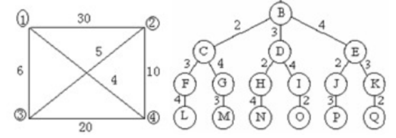

# 总复习题
## 选择
1. 分支策略与动态规划的主要区别在于
   1. 分治处理的子问题相互独立，动态规划处理的子问题重叠
2. 算法的空间复杂度是指
   1. 算法执行过程中所需的最大存储空间
3. 递归算法的主要缺点是
   1. 可能导致栈溢出
4. 最长公共子序列`LCS`问题中，若两个字符串长度分别为`m`和`n`，则动态规划解法的时间复杂度为
   1. $O(mn)$
5. 归并排序的空间复杂度为
   1. $O(n)$
6. 动态规划中“自底向上”的计算方式是
   1. 先求解小规模子问题，再逐步求解大规模问题
7. 快速排序的平均时间复杂度为
   1. $O(n\log n)$
8. 算法的时间复杂度与 编程语言的选择 无关
9. 下列算法中，不属于分治策略应用的是
   1.  冒泡排序
10. 动态规划算法的核心特性不包括
    1.  贪心选择性质
11. 二分查找算法的最坏时间复杂度为
    1.  $O(n\log n)$
12. 下列哪一项不是算法的基本特性
    1.  无限性
13. 遍历子集树的时间复杂度是
    1.  $O(2^n)$
14. 贪心算法能得到全局最优解的前提是问题具有
    1.  贪心选择性质和最优子结构性质
15. 回溯法在解空间树中采用的主要搜索策略是
    1.  DFS
16. 回溯法的递归实现通常采用什么搜索策略
    1.  DFS
17. 遍历排列树的时间复杂度是
    1.  $O(n!)$
18. 贪心算法与动态规划的主要区别之一是贪心算法
    1.  采用自顶向下的方式求解
19. 旅行商问题的解空间树类型是
    1.  排列树
20. 回溯法中界限函数的作用是
    1.  剪去无法得到最优解的子树
21. 活动安排问题 可以用贪心算法得到全局最优解
22. 回溯法中，正在产生儿子结点的节点称为
    1.  扩展节点
23. 回溯法中，自身已生成但儿子结点为全部生成的节点称为
    1.  活结点
24. 0-1背包问题的解空间树类型是
    1.  子集树
25. 回溯法中，所有儿子节点已生成的节点称为
    1.  死节点
26. 贪心算法的核心特征是
    1.  每次做出局部最优的选择，希望最终得到全局最优解
27. 活动安排问题中，贪心算法选择活动的核心策略是
    1.  选择最早结束时间的相容活动
28. 回溯法中，用于剪去不满足约束条件的子树的函数是
    1.  约束函数
29. 活动安排贪心算法中，输入的活动需按照 结束时间非减序 顺序排序
30. 分支限界法中，儿子结点被舍弃的情况
    1.  导致不可行解或非最优解
31. 多项式时间验证类VP与 NP 类等价
32. 单源最短路径分支限界法的剪枝策略
    1.  剪去当前路径长度大于已知最短路径的结点
33. 优先队列式分支限界法的活结点表采用的数据结构是
    1.  优先队列
34. 优先队列式分支限界法求解单源最短路径问题时，结点的优先级依据是
    1.  当前路径的长度
35. 队列式分支限界法选取扩展结点的原则是
    1.  先进先出
37. 舍伍德算法的核心设计思想的
    1.  将确定性算法随机化，使平均性能更优
38. 分支限界法中扩展结点会执行的操作是
    1.  一次性产生所有儿子结点
39. 多项式时间变换的主要用途
    1.  证明问题是NP完全
40. 跳跃表支持的搜索、插入、删除运算的平均时间复杂度是
    1.  $O(\log n)$
41. 随机投点法计算定积分时，积分值的近似值等于
    1.  $m / n$
42. 单元最短经分支限界法中，活结点表使用的是
    1.  极小堆
43. 随机投点法计算$\pi$ 值时，投点的区域是
    1.  单位正方形
44. 分支限界法中，活结点称为扩展结点后会执行的操作是
    1.  一次性产生其所有儿子结点
45. 跳跃表中附加指针的设置方式是
    1.  随机化方式确定
46. 关于分支限界法与回溯法的区别，说法错误的是
    1.  分支限界法的活结点表只能使用优先队列，无法使用普通队列
47. 关于分支限界法与回溯法在搜索方式上的区别是
    1.  回溯法深度优先，分支限界法广度或最小耗费优先
48. NP类语言的正确定义是
    1.  能被非确定性图灵机在多项式时间内接受的语言
49. 关于P类与NP类问题的关系
    1.  $P \in NP$且已证明$P = NP$

## 简答题
1. 简述递归与分治策略的基本思想，并举例说明其在算法设计中的应用？
   1. 递归：在函数的定义好的实现中直接或间接的调用自身，通过不断缩小问题规模，最终在边界条件处结束计算。应用：二叉树遍历
   2. 分治：将原问题划分为若干个规模更小、相互独立、形式相同的子问题，递归地求解各个子问题，将子问题的解合并为原问题的解。应用：归并排序
2. 什么是递归的栈溢出问题？如何避免或解决递归栈溢出？
   1. 递归的栈溢出问题是指在递归调用过程中，由于递归深度过大或递归无法正常终止，不断向调用栈中压入新的函数调用帧，最终超过系统为线程分配的栈空间上限，从而引发程序异常或崩溃
   2. 解决方法
      1. 保证递归正确收敛
      2. 将递归改写为迭代
      3. 尾递归优化
      4. 降低递归深度
      5. ​扩大栈空间
3. 现有`String s = { "", "G", "A", "Z", "C", "B", "A", "N", "D", "A" }`， `String t = { "", "G", "A", "Z", "C", "B", "C", "T", "B", "A" }`。采用动态规划算法求解最长公共子序列，试求出最长公共子序列的`c[i][j]`表   
   - 解法：$dp_{i, j} = \begin{cases}
        dp_{i - 1, j - 1} + 1 &\text{if }s_i = t_j \\
        \max\{dp_{i - 1, j}, dp_{i, j - 1}\} &\text{if }s_i \not= t_j
    \end{cases}$  

    | $\space$ | G | A | Z | C | B | A | N | D | A | 
    | --- | --- | --- | --- | --- | --- | --- | --- | --- | --- |  
    | G | 1 | 1 | 1 | 1 | 1 | 1 | 1 | 1 | 1 |  
    | A | 1 | 2 | 2 | 2 | 2 | 2 | 2 | 2 | 2 |
    | Z | 1 | 2 | 3 | 3 | 3 | 3 | 3 | 3 | 3 |
    | C | 1 | 2 | 3 | 4 | 4 | 4 | 4 | 4 | 4 |
    | B | 1 | 2 | 3 | 4 | 5 | 5 | 5 | 5 | 5 |
    | C | 1 | 2 | 3 | 4 | 5 | 5 | 5 | 5 | 5 |
    | T | 1 | 2 | 3 | 4 | 5 | 5 | 5 | 5 | 5 |
    | B | 1 | 2 | 3 | 4 | 5 | 5 | 5 | 5 | 5 |
    | A | 1 | 2 | 3 | 4 | 5 | 6 | 6 | 6 | 6 |
4. 矩阵连乘问题：给定7个矩阵$\{A_{1}, A_{2}, ..., A_{7}\}$，它们的维数如下表，现已给出按的嗯太贵画算法计算最优`m[i][j]`，请给出`m[3][7]`的计算过程  
   #### 矩阵维数  
   | $A_1$ | $A_2$ | $A_3$ | $A_4$ | $A_5$ | $A_6$ | $A_7$ | $A_8$ | 
   | --- | --- | --- | --- | --- | --- | --- | --- |
   | $15 × 25$ | $25 × 18$ | $18 × 27$ | $27 × 20$ | $20 × 14$ | $14 × 30$ | $30 × 10$ |  $10 × 25$ |   

   ![m[i][j]的值](dp-7.png)  
   - 解法： $dp_{i, j} = min_{i \le k \lt j} \{dp_{i, k} + dp_{k + 1, j} + p_{i - 1} \ldotp p_k \ldotp p_j \}$
   - $k \in \{ 3, 4, 5, 6\} \\
   dp_{3, 7} = \min \begin{cases}
    dp_{3, 3} + dp_{4, 7} + 18 * 27 * 10 = 19980 &\text{if } k = 3 \\
    dp_{3, 4} + dp_{5, 6} + 18 * 20 * 10 = 23520 &\text{if } k = 4 \\
    dp_{3, 5} + dp_{6, 7} + 18 * 14 * 10 = 21420 &\text{if } k = 5 \\
    dp_{3, 6} + dp_{7, 7} + 18 * 30 * 10 = 25200 &\text{if } k = 6
   \end{cases} = 19980$
5. 已知6个作业{ 1, 2, 3, 4, 5, 6 }要在两台机器$M_1$和$M_2$组成的流水线上完成加工。每个作业加工的顺序都是线在$M_1$上加工，然后在$M_2$加工。$M_1$和$M_2$加工作业$i$所需时间分别为$a_i$和$b_i$。如表所示，根据Johnson法则调度计算作业完成时间
    #### 作业时间
    | 作业号 | 1 | 2 | 3 | 4 | 5 | 6 |
    | --- | --- | --- | --- | --- | --- | --- |
    | $a_i$ | 4 | 2 | 6 | 7 | 8 | 3 |
    | $b_i$ | 3 | 4 | 5 | 6 | 9 | 7 |

    - 解法： $dp_{i} = \min\{a_i, b_i\} \\ T_{begin_{i}} = \max\{T_{M_{1_{i}}}, T_{M_{2_{i - 1}}}\}$
    - 顺序： 2, 6, 5, 4, 3, 1
    - 解得$T = 36$

## 算法设计

## 程序填空
1. 以下是采用贪心算法求解最优装载问题的代码，请把填空处理的代码补充完整
   ```java
    public class BestLoading {
        public float loading(float c, float[] w, int[] a) {
            int n = w.length;
            Element[] d = new Element[n];

            for(int i = 0; i < n; ++ i) {
                d[i] = new Element(w[i], i);
            }
            // TODO：sort(__)
            java.util.Arrays.sort(d);    

            for(int i = 0; i < n; ++ i) {
                a[i] = 0;
            }
            float op = 0;
            
            // TODO：第二个条件 i < n && __
            for(int i = 0; i < n && c > 0; ++ i) {
                // TODO: op += __
                op += d[i].w;
                c -= d[i].w;
                // TODO:x[__]
                x[d[i].i] = 1;
            }

            // TODO：返回值
            return op;
        }

        static class Element implements Comparable {
            float w;
            int i;

            public Element(float _w, int _i) {
                w = _w;
                i = _i;
            }

            @Override
            public int compareTo(Object x) {
                float tmp = ((Element)x).w;
                if(w < tmp) {
                    return -1;
                }else if(w == tmp) {
                    return 0;
                }else {
                    return 1;
                }
            }
        }

        public static void main(String[] args) {
            float[] w = { 20, 10, 26, 15 };
            float c = 70;
            int[] x = new int[w.length];

            BestLoading bl = new BestLoading();
            System.out.println("最优得到装载重量：" + bl.loading(c, w, x));
            System.out.println("被装载的集装箱号为：");
            for(int i = 0; i < w.length; ++ i) {
                if(x[i] == 1) {
                    System.out.print(i + " ");
                }
            }
        }
    }
   ```
2. 以下是采用回溯算法求解m着色的关键代码
   ```java
    public void backtrack(int t) {
        if(t > n) {
            sum ++;
            for(int i = 1; i <= n; ++ i) {
                System.out.print(x[i], " ");
            }
            System.out.println();
        }else {
            // TODO: i <= __
            /**
             * @param m 可以染m种颜色
             */
            for(int i = 1; i <= m; ++ i) {
                // TODO：x[t] = __
                x[t] = i;
                /**
                 * @brief 剪枝函数
                 */
                // TODO: ok(__)
                if(ok(t)) {
                    backtrack(t + 1);
                }
            }
        }
    }

    public boolean ok(int k) {
        for(int i = 1; i < k; ++ i) {
            /**
             * @brief 某条边的两个顶点着色不同
             * @param a[k][i] = 1 某条边
            */
            // TODO: __ && x[j] == x[k]
            if(a[k][i] = 1 && x[j] == x[k]) {
                return false;
            }

            // TODO: 返回值
            return true;
        }
    }
   ```
3. 以下是回溯法求解最大团问题的关键代码，把空格处代码补全
   ```java
    public class MaxClique {
        public int[] x;         ///< 当前解(x[i] = 1 表示i点在最大团中， x[i] = 0 表示不在团中)
        public int n;           ///< 图G的顶点数
        public int curN;        ///< 当前顶点数
        public int maxN;        ///< 当前最大顶点数
        public int[] ans;       ///< 当前最优解
        public int[][] edges;   ///< 图G的邻接矩阵，0表示不连通，1表示连通
        public int cnt;         ///< 图G的最大团个数

        public void backtrack(int t) {
            if(t > n) {
                for(int i = 1; i <= n; ++ i) {
                    ans[i] = x[i];
                    System.out.print(x[i], " ");
                }
                System.out.println();

                maxN = curN;
                cnt ++;
                return ;
            }else {
                boolean ok = true;
                /**
                 * @brief 检查顶点i是否与当前团全部连接
                 */
                // TODO:i < __
                for(int i = 1; i < t; ++ i) {
                    // TODO: x[i] == 1 && __
                    if(x[i] == 1 && edges[t][i] == 0) {
                        ok = false;
                        break;
                    }
                }

                /**
                 * @brief 从顶点i到已选入的顶点集中每一个顶点都有边相连
                 */
                if(ok) {
                    /**
                     * @brief 进入左子树
                     */
                    // TODO: x[t] = __
                    x[t] = 1;
                    curN ++;
                    // TODO: backtrack(__)
                    backtrack(t + 1);
                    // TODO: x[t] = __
                    x[t] = 0;
                    curN --;
                }

                /**
                 * @brief curN + n - t >= maxN时
                 * 进入右子树
                 * 如果不需要找到所有的解，则不需要等于
                 */
                if(curN + n - t >= maxN) {
                    /**
                     * @brief 进入右子树
                     */
                    x[t] = 0;
                    backtrack(t + 1);
                } 
            }
        }
    }
   ```
4. 以下是采用优先队列分支限界法实现的单源最短路径问题
   ```java
    public void BBShortest(int t) {
        PriorityQueue<Node> pq = new PriorityQueue<Node>();

        for(int i = 0; i < dist.length; ++ i) {
            dist[i] = INFINITE;
        }

        for(int i = 0; i < prev.length; ++ i) {
            prev[i] = -1;
        }

        /**
         * @brief 对给定的源结点进行初始化
         */
        Node src = new Node();
        src.id = t;
        src.length = 0;
        dist[t] = 0;
        // TODO: pq.add(__)
        pq.add(src);

        while(!pq.isEmpty()) {
            Node node = pq.poll();
            for(int i = 0; i < n; ++ i) {
                if(c[node.id][i] < INFINITE &&
                    c[node.id][i] < dist[i]
                ) {
                    /**
                     * @brief 更新该孩子结点的最优长度和前驱结点
                     * 然后再将其放入优先队列中
                     */
                    // TODO: dist[i] = __ + c[node.id][i]
                    dist[i] = node.length + c[node.id][i];
                    prev[i] = node.id;

                    // TODO: Node newNode = __
                    Node newNode = new Node();
                    // TODO: newNode.id = __
                    newNode.id = i;
                    newNode.length = dist[i];
                    // TODO: pq.add(__)
                    pq.add(newNode);
                }
            }
        }

        /**
         * @brief 信息输出
         */
        System.out.println(t + "号结点到其他结点的最短路径长度和路径分别为：");

        for(int i = 1; i < n; ++ i) {
            System.out.println("");
            if(dist[i] != INFINITE && i != t) {
                System.out.print("其路径为：： " + i + "<---");
                int tmp = i;
                
                while(prev[tmp] != t) {
                    System.out.print(prev[tmp] + "<---");
                    tmp = prev[tmp];
                }
                System.out.println(prev[tmp]);
            }
        }
    }
   ```
5. 以下是用分支限界法求解最大团问题的代码
   ```java
    public boolean findPath() {
        /**
         * @brief start == finish
         * 最短路径为0
         */
        if(start.row == finish.row && start.col == finish.col) {
            pathLength = 0;
            return true;
        }

        /**
         * @brief 初始化相对位移
         */
        Position[] offset = new Position[4];
        offset[0] = new Position(0, 1);     ///< right
        offset[1] = new Position(1, 0);     ///< down
        offset[2] = new Position(0, -1);    ///< left
        offset[3] = new Position(-1, 0);    ///< up

        /**
         * @brief 设置方阵“围墙”，方便处理方格边界的情况
         */
        for(int i = 0; i < size + 1; ++ i) {
            grid[0][i] = grid[size + 1][i] = -1;    ///< 顶部和底部
            grid[i][0] = grid[i][size + 1] = -1;    ///< 左边和右边
        }

        Position cur = new Position(start.row, start.col);
        grid[start.row][start.col] = 1;
        /**
         * @brief 数字0, 1表示方格的开放或封锁
         * 表示距离时，让所有距离都加1
         * 起始位置的距离为 0 + 1 = 1
         */
        int num = 4;

        l = new LinkedList<Position>();
        Position pos = new Position(0, 0);
        do {
            // TODO: __ < num
            for(int i = 0; i < num; ++ i) {
                // TODO: pos.row = __ + offset[i].row
                pos.row = cur.row + offset[i].row;
                pos.col = cur.col + offset[i].col;

                if(grid[pos.row][pos.col] == 0) {
                    // TODO: grid[pos.row][pos.col] = grid[cur.row][cur.col] + __
                    grid[pos.row][pos.col] = grid[cur.row][cur.col] + 1;
                    
                    if(pos.row == finish.row && pos.col == finish.col) {
                        break;
                    }

                    // TODO: l.add(new Position(pos.row, __))
                    l.add(new Position(pos.row, pos.cul));
                }
            }

            /**
             * @brief 检测是否到达目标位置finish
             */
            if(pos.row == finish.row && pos.col == finish.col) {
                break;
            }

            if(l.isEmpty()) {
                return false;
            }

            cur = l.poll();
        // TODO： while(__)
        }while(!l.isEmpty());

        for(int i = 0; i < grid.length; ++ i) {
            for(int j = 0; j < grid[i].length; ++ j) {
                System.out.print(grid[i][j] + "\t");
            }
            System.out.println();
        }

        /**
         * @brief 构造最短布线路径
         */
        pathLength = grid[finish.row][finish.col] - 2;
        path = new Position[pathLength];

        /**
         * @brief 从目标位置finish开始向起始位置回溯
         */
        cur = finish;

        for(int i = pathLength - 1; i >= 0; -- i) {
            path[i] = cur;

            /**
             * @brief 找前驱
            */
            for(int i = 0; i < num; ++ i) {
                pos.row = cur.row + offset[i].row;
                pos.col = cur.col + offset[i].col;

                if(grid[pos.row][pos.col] == i + 2) {
                    break;
                }
            }
            cur = new Position(pos.row, pos.col);
        }
        System.out.println("最短路线为：");

        for(int i = 0; i < pathLength; ++ i) {
            System.out.println((i + 1) + " pos: (" + path[i].row + ", " + path[i].col + ")");
        }
        System.out.println("布线长度：" + pathLength);

        return true;
    }
   ```

## 算法理解
1. 以下是快速排序的代码：
   ```java
    public class quickSort {
        public static void quickSort(int[] arr, int low, int high) {
            int i, j, temp;
            if (low > high) {
                return;
            }

            i = low;
            j = high;
            // temp就是基准位
            temp = arr[low];

            while (i < j) {
                // 先看右边，依次往左递减
                while (temp <= arr[j] && i < j) {
                    j--;
                }

                // 再看左边，依次往右递增
                while (temp >= arr[i] && i < j) {
                    i++;
                }

                // 如果满足条件则交换
                /*
                * if (i<j) { t = arr[j]; arr[j] = arr[i]; arr[i] = t; }
                */
                swap(arr, i, j);
            }

            // 最后将基准为与i和j相等位置的数字交换
            arr[low] = arr[i];
            arr[i] = temp;

            // 递归调用左半数组
            quickSort(arr, low, j - 1);

            // 递归调用右半数组
            quickSort(arr, j + 1, high);
        }

        private static void swap(int[] list, int i, int j) {
            int temp = list[i];
            list[i] = list[j];
            list[j] = temp;
        }

        public static void main(String[] args) {
            int[] arr = { 13, 5, 2, 7, 30, 3, 1, 8, 9, 19 };
            quickSort(arr, 0, arr.length - 1);

            for (int i = 0; i < arr.length; i++) {
                System.out.print(arr[i]);
                System.out.print("  ");
            }
        }
    }
   ```  
   根据程序表示出数组`arr`排序的过程  
   1. [ 13, 5, 2, 7, 30, 3, 1, 8, 9, 19 ]
   2. [ 13, 5, 2, 7, 9, 3, 1, 8, 30, 19 ]
   3. [ 8, 5, 2, 7, 9, 3, 1, 13, 30, 19 ]
   4. [ 8, 5, 2, 7, 9, 3, 1, 13, 19, 30 ]
   5. [ 8, 5, 2, 7, 1, 3, 9, 13, 19, 30 ]
   6. [ 3, 5, 2, 7, 1, 8, 9, 13, 19, 30 ]
   7. [ 3, 5, 2, 1, 7, 8, 9, 13, 19, 30 ]
   8. [ 3, 1, 2, 5, 7, 8, 9, 13, 19, 30 ]
   9. [ 1, 3, 2, 5, 7, 8, 9, 13, 19, 30 ]
   10. [ 1, 2, 3, 5, 7, 8, 9, 13, 19, 30 ]
2. 以下是合并排序的代码
   ```java
    public class MergeSort {
        static int a[] = { 30, 10, 18, 5, 3, 8, 9, 2, 1, 4, 13 };
        static int b[] = new int[a.length];

        public static void main(String[] args) {
            mergeSort(0, 10);
            for (int i = 0; i < b.length; i++){
                System.out.print(a[i] + " ");
            }
        }

        //把数组a中从left到right之间的元素进行合并排序

        public static void mergeSort(int left, int right) {
            if (left < right) {//从left到right之间的元素大于1
                int mid = (left + right) / 2;//把(left,right)分成2个区间
                mergeSort(left, mid);//把左区间(left,mid)的元素排序
                mergeSort(mid + 1, right);//把右区间(mid,right)的元素排序
                merge(left, mid, right);
                //把左右两个已经排序的区间合并排序到数组b中
                copy(a, b, left, right);//把数组b中排好序的元素复制到数组a
            }
        }

        private static void copy(int[] a2, int[] b2, int left, int right) {
            for (int i = left; i <= right; i++){
                a[i] = b[i];
            }
        }

        public static void merge(int left, int mid, int right) {
            int start = left;//左区间待放入到b中元素的位置
            int temp = mid + 1;//右区间待放入到b中元素的位置
            int index = left;//b数组中待放入元素的位置

            while ((start <= mid) && (temp <= right)) {
                //左右两个区间都存在着待放入b数组的元素
                if (a[start] <= a[temp]) {//左区间待放入元素比较小
                    b[index++] = a[start++];

                    //左区间待放入元素放到b数组中，放入后把左区间待放入元素位置和b数组待放入
                    //元素位置分别指向下一个
                } else {//右区间待放入元素比较小
                    b[index++] = a[temp++];//右区间待放入元素放到b数组中，
                    //放入后把右区间待放入元素位置和b数组待放入元素位置分别指向下一个
                }
            }

            //左右两个区间有一个区间的元素已经完全放到到b数组
            if (start > mid) {//左区间的元素已经完全放到到b数组
                for (int i = temp; i <= right; i++){
                    //把右区间剩余的元素全部放到b中
                    b[index++] = a[i];
                }
            } else {
                //右区间的元素已经完全放到到b数组
                for (int i = start; i <= mid; i++){
                    //把左区间剩余的元素全部放到b中
                    b[index++] = a[i];
                }
            }
        }
    }
   ```
   根据程序画图示意数组`a`排序的过程
   1. [ 30, 10, 18, 5, 3, 8, 9, 2, 1, 4, 13 ]
   2. [ 10, 30, 3, 5, 18, 8, 9, 1, 2, 4, 13 ]
   3. [ 3, 5, 10, 18, 30, 1, 2, 4, 8, 9, 13 ]
   4. [ 1, 2, 3, 4, 5, 8, 9, 10, 18, 30, 13 ]
3. 以下代码实现二分搜索技术
   ```java
    public class BinarySearch {
        public static void main(String[] args) {
            int a[] = { 2, 5, 6, 10, 18, 25, 28, 29, 33, 36, 37, 38, 40, 43, 48 ,50, 58, 60, 62, 65, 68 };
            binarySearch(a, 34, a.length);
        }

        public static int binarySearch(int[] a, int x, int n) {
            int l = 0;
            int r = n - 1;

            while(l <= r) {
                int mid = (l + r) >> 1;
                if(x == a[mid]) {
                    return mid;
                }else if(x > a[mid]) {
                    l = mid + 1;
                }else {
                    r = mid - 1;
                }
            }

            return -1;
        }
    }
   ```
   根据代码计算比较了哪些元素，与元素比较时`l`与`r`的值是什么？
   1. l = 0, r = 21, a[mid] = 37
   2. l = 0, r = 9, a[mid] = 18
   3. l = 5, r = 9, a[mid] = 29
   4. l = 8, r = 9, a[mid] = 33
   5. l = 9, r = 9, a[mid] = 36
4. 以下是回溯法求解圆排列问题的程序，现有半径分别为1, 1, 2的三个圆，按2, 1, 1排列时，按此算法求解时各圆心的值是什么？排列值是多少？
   ```java
    public class Circles {
        public int n; ///< 待排列圆的个数
        public float min; ///< 当前最优值
        public float[] x; ///< 当前圆排列圆心横坐标
        public float[] r; ///< 当前圆排列

        public float circlePerm(int _n, float[] _r) {
            n = _n;
            r = _r;
            min = 1e9 + 7;
            x = new float[n + 1];

            backtrack(1);

            return min;
        }

        public void backtrack(int t) { 
            if(t > n) {
                compute();
            }else {
                for(int j = t; j <= n; ++ j) {
                    swap(r, t, j);
                    float centerX = center(t);
                    if(centerX + r[t] + r[1] < min) {
                        x[t] = centerX;
                        backtrack(t + 1);
                    }
                    swap(r, t, j);
                }
            }
        }

        public void <T> swap(T[] a, int i, int j) {
            T tmp = a[i];
            a[i] = a[j];
            a[j] = tmp;
        }

        public float center(int t) {
            float tmp = 0;
            for(int i = 1; i < t; ++ i) {
                float valueX = (float)(x[i] + 2.0 * Math.sqrt(r[t] * r[i]));
                if(valueX > tmp) {
                    tmp = valueX;
                }
            }

            return tmp;
        }

        public void compute() {
            float l = 0, h = 0;
            for(var i = 0; i <= n; ++ i) {
                if(x[i] - r[i] < l) {
                    l = x[i] - r[i];
                }
                if(x[i] + r[i] > h) {
                    h = x[i] + r[i];
                }
            }

            if(h - l < min) {
                min = h - l;
            }
        }

        public static void main(String[] args) {
            int n = 3;
            float[] r = { 0, 1, 1, 2 };
            Circles c = new Circles();

            float min = c.circlePerm(n, r);
            System.out.println(min);
        }
    }
   ```
   1. 0, $2\sqrt{2}$, $2\sqrt{2} + 2$
   2. $2\sqrt{2} + 5$
5. 以下是以分治法求解棋盘问题的代码，按`main`函数中调用，画图表示此棋盘的覆盖过程
    ```java
    public class ChessBoard {
        int tc;     ///< 棋盘左上方方格的行列
        int dr;
        int dc;     ///< 分别是特殊方格的行和列
        int size;
        int[][] board;
        int cnt = 1;

        ChessBoard() { }
        ChessBoard(int _size) {
            size = _size;
            board = new int[size][size];
        }

        public void chessBoard(int _tr, int _tc, int _dr, int _dc, int _size) {
            if(_size == 1) {
                return ;
            }

            int cover = cnt ++;
            int s = _size / 2;
            if(_dr < _tr + s && _dc < _tc + s) {
                chessBoard(_tr, _tc, _dr, _dc, s);
            }else {
                board[_tr + s - 1][_tc + s - 1] = cover;
                chessBoard(_tr, _tc, _tr + s - 1, _tc + s - 1, s);
            }

            if(_dr >= _tr + s && _dc < _tc + s){
                chessBoard(_tr + s, _tc, _dr, _dc, s);
                //tr+s作为左下角
            }else{
                board[_tr + s][_tc + s - 1] = cover;
                chessBoard(_tr + s, _tc, _tr + s, _tc + s - 1, s);//左下角
            }

            if(_dr >= _tr + s && _dc >= _tc + s){
                chessBoard(_tr + s, _tc + s, _dr, _dc, s);
            }else{
                board[_tr + s][_tc + s] = cover;//覆盖左上角
                chessBoard(_tr + s, _tc + s, _tr + s, _tc + s, s);
                //没有的话覆盖其他方格
            }
        }

        public void show(){
            for(int i = 0; i < size; ++ i){
                for(int j = 0; j < size; ++ j){
                    if(j == 0){
                        System.out.print(board[i][j]);
                    }else{
                        System.out.printf("%4d",board[i][j]);
                    }
                }

                System.out.println();
            }
        }

        public static void main(String args[]){
            ChessBoard cb =new ChessBoard(8);

            cb.chessBoard(0, 0, 4, 6, 8);
            cb.show();
        }
    }
    ```

    | | | | | | | | | |
    | --- | --- | --- | --- | --- | --- | --- | --- | --- |
    | | 2 | 2 | 3 | 3 | 6 | 6 | 7 | 7 | 
    | | 2 | 1 | 1 | 3 | 6 | 5 | 5 | 7 |
    | | 4 | 1 | 8 | 8 | 9 | 9 | 5 | 10 |
    | | 4 | 4 | 8 | 1 | 1 | 9 | 10 | 10 |
    | | 11 | 11 | 12 | 12 | 13 | 0 | 14 | 14 |
    | | 11 | 15 | 15 | 12 | 13 | 13 | 16 | 14 |
    | | 17 | 15 | 18 | 18 | 19 | 16 | 16 | 20 |
    | | 17 | 17 | 18 | 19 | 19 | 20 | 20 | 20 |
    > 如果它没有写错的话
6. 用优先队列分支限界法求解如下图所示的旅行销售员问题，写出求解过程中队列的变化情况
   
7. 用队列式分支限界法求解如下图所示的旅行销售员问题，写出求解过程中队列的变化情况
   
8. 用随机投点法计算$\pi$值时，输入参数n的大小对计算结果有什么影响
   1. n越大，计算结果越精确
