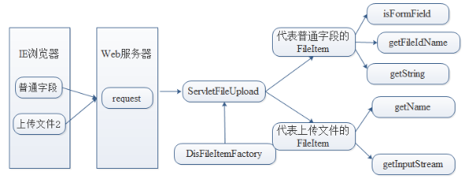

# Java-Web
## 代码填空
1. 编写一个ProductServlet，创建一个包含3个商品的List（商品Product的构造函数如下，商品信息可任意填写），将商品列表设置到request属性中，然后跳转到product.jsp显示商品列表。   
   ```java
   public class ProductServlet extends HttpServlet {
      protected void doGet(HttpServletRequest request, HttpServletResponse response) throws ServletException, IOException {
         List<Product> products = new ArrayList<>();

         //TODO: 添加商品
         products.add(new Product(1, "Java", 40.0));
         products.add(new Product(2, "Java", 40.0));
         products.add(new Product(3, "Java", 40.0));

         // TODO：设置参数
         request.setAttribute("products", products);

         // TODO: 跳转jsp页面
         request.getRequestDispatcher("/product.jsp").forward(request, response);
      }
   }
   ```

2. 编写一个JSP页面，已知两个变量a和b如下所示，请将a和b存入page域，然后使用EL表达式，分两行输出a+b及a*b的值。  
   ```jsp
   <%@ page contentType="text/html;charset=UTF-8" %>
   <html>
      <body>
         <%!
            int a = 5; // 成员变量
            int b = 3;
         %>  

         <!-- 将成员变量存入page域，让EL可访问 -->
         <% 
            pageContext.setAttribute("a", a);
            pageContext.setAttribute("b", b); 
         %>

         ${a+b}
         <br />  
         ${a*b} 
      </body>
   </html>
   ```  

3. 编写一个MySQL查询，查询商品表中价格低于 100 元的商品名称和价格（商品表名为：product_table，返回的 products 包含 productName 和 price 两个字段）  
   > 属于DAO模块   
   ```java
   public class ProductQuery {
      public List<Product> getProducts(Connection connect) throws SQLException {
         List<Product> products = new ArrayList();

         String sql = "SELECT productName, price FROM product_table WHERE price < ?";

         try(PreparedStatement state = connect.preparedStatement(sql)) {
            state.setInt(100);

            try(ResultSet rs = state.executeQuery()) {
               while(rs.next()) {
                  String name = rs.getString("productName");
                  double price = rs.getDouble("price");
                  products.add(new Product(name, price));
               }
            }
         }

         return products;
      }
   }
   ```

4. 编写一个JSP页面，使用JSTL的forEach标签遍历显示一个产品价格列表(显示字段为上题的productName和price)。   
   > JSP标签模块
   ```jsp
   <%@ taglib prefix="c" uri="http://java.sun.com/jsp/jstl/core" %>
   <table>
      <c:forEach var="product" items="${products}">
         <tr>
            <td>${product.productName}</td>
            <td>${product.price}</td>
         </tr>
      </c:forEach>
   </table>
   ```

5. 管理员在后台添加商品信息时，需填写商品名称、价格、库存，提交前通过validateProduct()函数进行多规则验证，收集所有错误并统一提示。验证失败返回false，成功返回true。
验证规则：
   1. 商品名称（productName）不能为空；
   2. 价格（price）不能为空，且必须是大于 0 的数字（支持小数）；
   3. 库存（stock）不能为空，且必须是大于等于 0 的整数；
   4. 若存在多个错误，需将所有错误信息汇总后弹窗提示。
   > Javascript验证
   ```js
   // TODO： 验证
   function validateProduct() {
      var productName = document.getElementById("productName").value.trim();
      var price = document.getElementById("price").value.trim();
      var stock = document.getElementById("stock").value.trim();     
      var errors = [];
      if (productName == "") {
         errors.push("商品名称不能为空");
      } 
      if (price === "" || isNaN(price) || parseFloat(price) <= 0) {
         errors.push("价格必须为大于0的数字");
      } 
      if (stock == "" || !Number.isInteger(parseFloat(stock)) || parseInt(stock) < 0) {
         errors.push("库存必须为大于等于0的整数");
      } 
      if (errors.length > 0) {
         alert("请修正以下错误：\n" + errors.join("\n"));
         return false;
      }    

      return true;   
   }
   ```

6. 写一个商品类，包含的字段为：productId，productName，price。有带参构造方法，Getter和Setter方法。
   ```java
   public class Product {
      private String productId;
      private String productName;
      private double price; 
    
      public Product() { }

      public Product(String productId, String productName, double price) {
         this.productId = productId;
         this.productName = productName;
         this.price = price;
      }                                  
      
      // TODO: 实现对应的Setter和Getter
      public String getProductId() {
         return productId;
      }    
      public void setProductId(String productId) {
         this.productId = productId;
      }                                       
      
      public String getProductName() {
         return productName;
      }    
      public void setProductName(String productName) {
         this.productName = productName;
      }                                    

      public double getPrice() {
         return price;
      }    
      public void setPrice(double price) {
         this.price = price;
      }                                    
   }
   ```

## 代码大题
1. 用户登录系统
   1. 需求描述：
      实现一个用户登录系统，包含登录、注册、用户信息管理功能。
   2. 技术要求：
      1. 使用MVC模式：Servlet作为控制器，JSP作为视图，JavaBean作为模型
      2. 使用DAO模式操作MySQL数据库
      3. 使用JSTL和EL在JSP页面展示数据
      4. 实现会话管理，登录后跳转到欢迎页面
      5. 数据库表结构：
         ```sql
         CREATE TABLE users (
            id INT PRIMARY KEY AUTO_INCREMENT,
            username VARCHAR(50) UNIQUE NOT NULL,
            password VARCHAR(100) NOT NULL,  -- 存储加密后的密码
            email VARCHAR(100),
            role VARCHAR(20) DEFAULT 'user', -- admin/user
            created_at TIMESTAMP DEFAULT CURRENT_TIMESTAMP
         );
         ```
   3. 具体要求：
      1. 编写User实体类（包含所有字段及getter/setter）
      2. 编写UserDAO接口和实现类（包含用户CRUD操作）
      3. 编写LoginServlet处理登录逻辑
      4. 编写RegisterServlet处理注册逻辑
      5. 编写login.jsp（登录页面）
      6. 编写register.jsp（注册页面）
      7. 编写welcome.jsp（登录成功页面）
      8. 使用Filter实现字符编码过滤
   4. 评分标准：
      1. 实体类和DAO实现完整（5分）
      2. Servlet逻辑正确（5分）
      3. JSP页面规范，使用EL/JSTL（5分）
      4. 数据库连接和异常处理正确（5分）
      5. 功能完整，代码规范（5分）
   > jsp: `<c: forEach>`
   ```java
   /** 
    * @file User Entity
    */
   package com.example.entity;

   public class User {
      private String m_Name;
      private String m_Password;
      private String m_Email;

      // TODO: 提供有参构造和无参构造
      User() { }
      User(String name, String pwd, String email) {
         m_Name = name;
         m_Password = pwd;
         m_Email = email;
      }
   }
   ```
   ```properties
   # 数据库配置
   jdbc.driver=com.mysql.cj.jdbc.Driver
   jdbc.url=jdbc:mysql://localhost:3306/user_management?useSSL=false&serverTimezon
   e=Asia/Shanghai&characterEncoding=utf8
   jdbc.username=root
   jdbc.password=123456

   # 连接池配置（可选）
   # dbcp.initialSize=5
   # dbcp.maxActive=20
   # dbcp.maxIdle=10
   ```
   ```java
   package com.example.dao;

   import com.example.entity.User;
   import java.util.List;

   public interface IUserDAO {
      boolean add(User user) throws Exception;
      ...
   } 

   public class UserDAO implements IUserDAO {
      @Override
      public boolean add(User user) throws Exception {
         Connection connect = null;
         PreparedStatement state = null;
         ResultSet rs = null;

         // TODO: 数据库连接
         try {
            connect = DBUtil.getConnection();
            String sql = "INSERT INTO users(username, password, email) VALUES(?, ?, ?);";
            state = connect.preparedStatement(sql, Statement.RETURN_GENERATED_KEYS);

            state.setString(1, user.getName());
            state.setString(2, user.getPassword());
            state.setString(2, user.getEmail());

            int rows = state.executeUpdate();

            if(rows > 0) {
               rs = state.getGeneratedKeys();
               if(rs.next()) {
                  user.setID(rs.getInt());
               }
            }

            return rows > 0;
         }finally {
            DBUtil.close(connect, state, rs);
         }
      }

      @Override
      public boolean update(User user) throws Exception {
         Connection connect = null;
         PreparedStatement state = null;

         try {
            connect = DBUtil.getConnection();
            String sql = "UPDATE users SET email=? WHERE id=?;";
            state = connect.preparedStatement(sql);

            state.setString(1, user.getEmail());
            state.setString(2, user.getID());

            int rows = state.executeUpdate();
            return rows > 0;
         }finally {
            DBUtil.close(connect, state);
         }
      }
   }
   ```

## 简答题
### JSP 部分
1. **简述JSP中page、request、session、application四种作用域的生命周期和应用场景**
   - pageContext：当前JSP页面内有效，页面执行完毕销毁，用于页面内数据传递
   - request：一次请求范围内有效（包括转发），常用于Servlet向JSP传递数据
   - session：一次用户会话期间有效，常用于保存用户登录状态、购物车信息
   - application：整个Web应用运行期间有效，所有用户共享，用于保存全局配置、计数器
2. **解释JSP的include指令（`<%@ include %>`）和include动作（`jsp:include`）的区别**
   - *包含时机*：指令是静态包含，在JSP编译时包含；动作是动态包含，在请求时包含
   - *内容处理*：指令包含源代码，被包含文件不能独立编译；动作包含执行结果，被包含文件可独立编译*
   - 更新方式：修改被包含文件时，指令方式需要重新编译主页面；动作方式无需重新编译
   - 文件类型：指令只能包含JSP文件；动作可包含JSP、HTML、Servlet等
3. **简述JSP页面的首次请求运行流程**
   - 客户端发送请求:用户通过浏览器访问一个JSP页面，发送HTTP请求到服务器。 
   - JSP容器转换JSP文件:服务器接收到请求后，JSP容器将JSP文件转换为一个Java Servlet源文件(`.java`文件)。如果转换过程中发现语法错误，则中断并返回错误信息
   - 编译为字节码文件:转换成功后，JSP容器将Java源文件编译成对应的字节码文件(`.class`文件)，该文件即为一个Servlet类。
   - 加载Servlet类并初始:Servlet容器加载该Servlet类，创建实例，并执行jspInit()方法进行初始化。
   - 处理请求并生成响应:JSP容器调用jspService()方法处理请求，JSP中的动态内容被执行为HTML，最终生成完整的响应页面。
4. **请简要对比C/S架构和B/S架构的特点**
   - C/S架构（Client/Server，客户端/服务器架构）：客户端和服务器分工明确，客户端负责用户界面和业务逻辑，服务器负责数据处理和存储。通常需要安装专用的客户端软件。通信一般基于专用协议，如TCP/IP。
   - B/S架构（Browser/Server，浏览器/服务器架构）：用户通过浏览器访问应用，所有业务逻辑和数据处理都在服务器端完成。客户端无需安装额外软件，只需标准浏览器。基于HTTP/HTTPS协议通信。

### Servlet 部分
1. **简述Filter过滤器的工作原理和典型应用场景**
   - 工作原理：在请求到达Servlet之前和响应发送到客户端之前拦截处理，通过FilterChain传递请求
   - 典型应用：字符编码过滤、用户权限验证、日志记录、数据压缩、XSS防护、性能监控
   - 配置方式：通过`web.xml`配置或使用`@WebFilter`注解，可指定过滤的URL模式
2. **说明Servlet中重定向(sendRedirect)和转发(forward)的区别**
   - 请求次数：重定向是客户端两次请求，转发是服务器端一次请求
   - 地址栏变化：重定向后浏览器地址栏改变，转发不变
   - 数据共享：重定向不能共享request数据，转发可以
   - 应用范围：重定向可跳转到外部站点，转发只能应用内部跳转
   - 效率：转发效率更高，因为减少了一次客户端请求
3. **用图形描述Commons-FileUpload组件通过Servlet实现文件上传功能的工作流程**
   - 

### EL表达式
1. 请简述 CSS 的 4 种引用方式，并说明实际开发中最常用的方式及原因
   - 行内式：通过标签的 style 属性设置样式，仅作用于当前标签，未实现结构与样式分离，不推荐使用
   - 内嵌式：将 CSS 代码写在 HTML 的`<style>`标签内（位于`<head>`中），仅对当前页面有效，适合单个页面开发
   - 链入式（外链式）：通过`<link>`标签引入外部`.css`文件，实现结构与样式完全分离，支持多页面共享样式，是实际开发中最常用的方式
   - 导入式：通过`<style>`内的`@import`语句引入外部 CSS 文件，需等页面完全下载后才加载样式，可能导致页面暂时无样式，使用较少
2. JSP中`include`指令与`jsp:include`动作元素有什么区别
   - `include`指令:
      - 使用`<%@ include file="文件" %>`引入文件。
      - 在编译阶段将文件内容原封不动地插入当前页面，最终编译成一个Servlet。
      - 不支持JSP表达式，`file`属性为静态路径。
      - 包含文件中不能有与当前页面重复的变量或方法
   - `jsp:include`动作元素：
      - 使用`<jsp:include page="URL" />`引入文件
      - 在运行时单独编译被包含文件，将执行结果插入当前页面。
      - 支持JSP表达式，`page`属性可为动态路径。
      - 包含文件与当前页面的变量和方法不冲突，可独立编译
3. 列举EL表达式中常用的隐式对象（至少8个）并说明其作用
   - pageScope, requestScope, sessionScope, applicationScope：访问各作用域属性
   - param, paramValues：获取请求参数
   - header, headerValues：获取请求头信息
   - cookie：访问Cookie值
   - initParam：获取上下文初始化参数
   - pageContext：访问JSP的PageContext对象
4. 说明EL表达式中empty运算符的判断规则
   - empty运算符在以下情况返回true：
      - 值为null
      - 空字符串（""）
      - 空数组（length=0）
      - 空集合（size=0）
      - 空Map

### JSTL 标签库
1. **简述JSTL核心标签库（Core）的主要功能分类，并各举一例**
   - 通用标签：如`<c:set>`设置变量，`<c:out>`输出内容
   - 条件标签：如`<c:if>`条件判断，`<c:choose>`多分支选择
   - 迭代标签：如`<c:forEach>`遍历集合，`<c:forTokens>`分割字符串
   - URL标签：如`<c:url>`构造URL，`<c:import>`导入资源
   - 异常处理：`<c:catch>`捕获异常
2. **说明<c:forEach>标签的常用属性和varStatus属性的作用**
   - 常用属性：items（要遍历的集合）、var（当前项变量名）、begin（起始索引）、end（结束索引）、step（步长）
   - varStatus属性：提供循环状态信息，如index（当前索引，从0开始）、count（当前计数，从1开始）、first（是否第一项）、last（是否最后一项）

### MySQL 数据库
1. 解释数据库事务的ACID特性
   1. 原子性（Atomicity）：事务是不可分割的最小单位，要么全部成功，要么全部失败回滚
   2. 一致性（Consistency）：事务执行前后数据库必须保持一致性状态
   3. 隔离性（Isolation）：并发事务之间相互隔离，互不干扰
   4. 持久性（Durability）：事务提交后对数据库的修改是永久性的
2. **简述DAO模式的设计结构和各层职责**
   1. 实体类（Entity/POJO）：对应数据库表的JavaBean，封装数据
   2. DAO接口：定义数据访问操作的方法声明
   3. DAO实现类：实现接口，使用JDBC操作数据库
   4. 业务逻辑层（Service）：调用DAO方法，处理业务逻辑
   5. 控制层（Controller/Servlet）：接收请求，调用Service，返回响应

