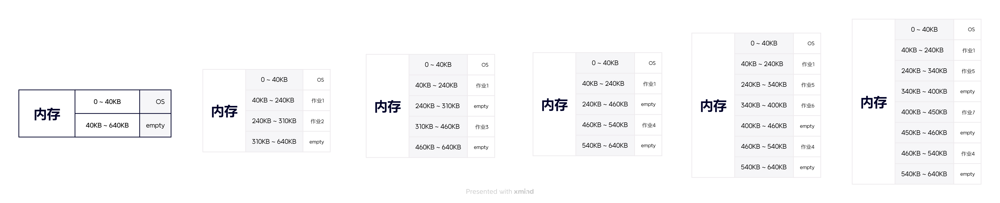
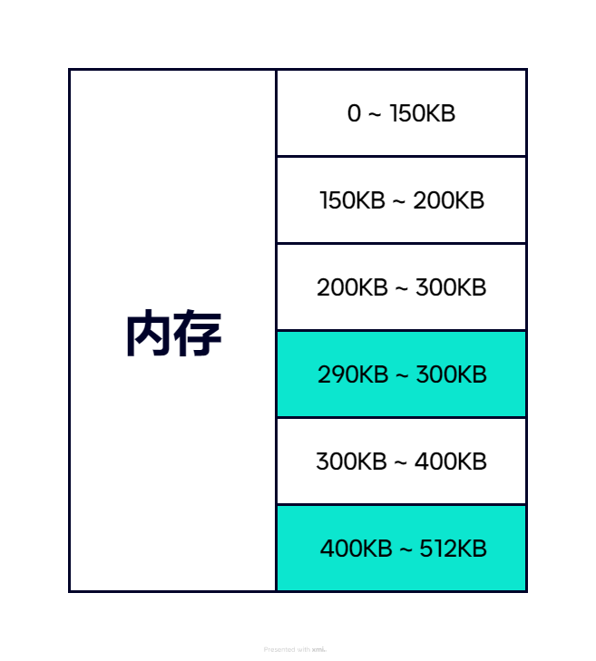
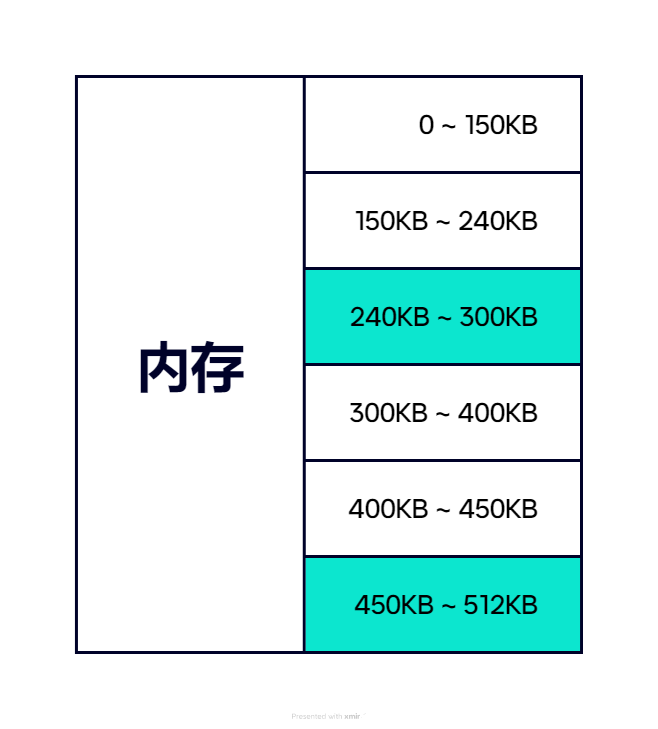
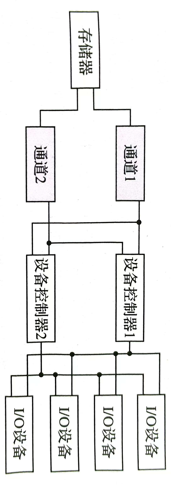
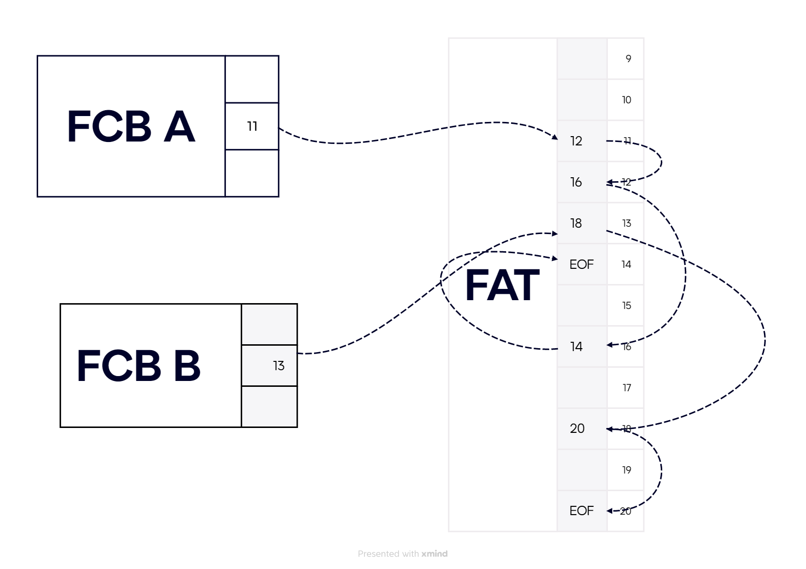

# Operating System
- ***以下只对作业中的题目进行解释，部分题目会进行详细的说明***
- 具体内容请参考[知乎](https://zhuanlan.zhihu.com/p/675495917)
## 引论
1. *在计算机系统上配置的OS的目标是什么？*
   - 有效性、方便性、可扩充性、开放性
2. *作用主要表现在哪几个方面？*
   - OS作为用户与计算机硬件系统之间的接口
   - OS作为计算机资源的管理者
   - OS实现了对计算机资源的抽象
3. 试说明OS与硬件、其他系统软件以及用户之间的关系
   - 给用户提供一个管理界面
   - 用来管理硬件的运行
   - 给软件提供基础
4. *试说明推动OS发展的主要动力是什么*
   - 计算机系统的性能的快速提高
   - 硬件成本的下降
   - 不断增长的应用需求
5. 在OS中，何谓脱机I/O方式和联机I/O方式？
   - 脱机I/O是指事先将装有用户程序和数据的纸带或卡片装入纸带输入机或卡片机，在外围机的控制下，把纸带或卡片上的数据或程序输入到磁带上。该方式下的输入输出由外围机控制完成，是在脱离主机的情况进行的。
   - 联机I/O方式是指程序和数据的输入输出都是在主机的直接控制下进行的
6. 为什么要引入实时系统？
   - 实时操作系统是指系统能及时响应外部事件的请求，在规定的时间内完成对该事件的处理，并控制所有实时任务协调一致地运行
   - 引入实时OS是为了满足应用的需求，更好地满足实时控制领域和实时信息处理领域的需要
7. 试从及时性、交互性及可靠性方面对分时系统与实时系统进行比较  
    | 属性 | 分时系统 | 实时系统 |
    |---|---|---|
    | 及时性 | 有间隔时间 一般是1-2s 人们能够等待 | 对系统的响应速度有很高要求 |
    | 交互性 | 关键问题 用户可以通过终端与系统进行广泛的交互 | 实时系统的交互仅限于访问系统特定专用服务程序，有很大局限性 |
    | 可靠性 | 相对高 | 要求绝对高 |
8. **何谓原语？何谓原子操作？**
   - 由若干条指令组成的，用于完成一定功能的一个过程
   - 指一个操作中的所有动作要么全做，要么全不做，此即原子性
9.  什么是微内核OS？
    - 足够小的内核
    - 基于客户/服务器模式
    - 应用机制与策略分离原理
    - 采用面向对象技术
10. 它具有那些优点？
    - 提高了系统的可扩展性
    - 增强了系统的可靠性和可移植性
    - 提供了对分布式系统的支持
    - 融入了面向对象的技术

## 进程的描述与控制
1. 什么是前趋图？
   - 前趋图是一个有向无环图，记为DAG，用于描述进程之间执行的前后关系
2. 请画出下面四条语句的前趋图。  
   $S_{1}: a = x + y$  
   $S_{2}: b = z + 1$  
   $S_{3}: c = a - b$  
   $S_{4}: w = c + 1$
   ```mermaid
    graph LR
        a(a = x + y) --> c(c = a - b)
        b(b = z + 1) --> c
        c --> d(w = c + 1)
   ```
3. 什么是进程？OS中为什么要引入进程？它会产生什么影响？
   - 进程：进程是程序的执行过程，是系统进行资源分配和调度的一个独立单位
   - 影响：实现多个程序的并发执行，极大提高了资源利用率和系统吞吐量
4. 进程最基本的状态由哪些？
   - 执行态、就绪态、阻塞态
5. 哪些事件可能会引起不同状态间的转换？
   ```mermaid
    graph LR
        执行 --> 就绪
        就绪 --> 执行
        阻塞 --> 就绪
        执行 --> 阻塞
   ```
6. *为什么要引入进程的挂起状态？*
   - 终端用户的需要
   - 父进程请求
   - 负荷调节的需要
   - OS的需要
7. 在创建一个进程时，OS需要完成的主要工作是什么？
   - 调用进程撞见原语
   - 申请一个空白PCB
   - 填写用于控制和管理进程的信息
   - 分配运行时所需的资源
   - 把PCB转入就绪状态
   - 插入到就绪队列中

## 处理机调度与死锁
### 课后题与例题
1. 高级调度与低级调度的主要任务是什么？
   - 高级调度：将外存的作业调入内存
   - 低级调度：为内存中处于就绪态的作业分配处理机
2. 为什么要引入中级调度？
   - 为了提高内存的利用率与系统吞吐量
3. 何谓作业和JCB？
   - 作业是一组程序与数据和作业说明书，是高级调度的基本单位
   - JCB是作业控制块，是作业存在的表示，包含管理、调度所需的全部信息
4. 在上面情况下需要使用JCB？其中包含了哪些内容？
   - 作业进入系统
   - 包含系统对作业调度、管理的全部信息
5. 在作业调度中应如何确定接纳了多少个作业和接纳哪些作业？
   - 取决于多道程序度和调度算法
6. 试说明低级调度的主要功能
   - 从就绪队列中根据调度算法选择一个进程分配处理机
7. *有5个进程需要调度执行，若采用非抢占式优先级（短进程优先）调度算法，问这五个进程的平均周转时间是多少？*
   | 进程 | 到达时间 | 执行时间 | 
   |---|---|---|
   | $P_{1}$ | $0.0$ | $9$ |
   | $P_{2}$ | $0.4$ | $4$ |
   | $P_{3}$ | $1.0$ | $1$ |
   | $P_{4}$ | $5.5$ | $4$ |
   | $P_{5}$ | $7.0$ | $2$ |
   - 执行顺序：$P_{1}$ -> $P_{3}$ -> $P_{5}$ -> $P_{2}$ -> $P_{4}$
   - 平均周转时间：$t = \sum^{5}_{i = 0} P_{exec_{i}} / 5 = 10.62$
  >这里只计算运行时间的总和是因为$P_{1}$执行后，所有进程均已进入就绪态
8. *假定要在一台处理机上执行如表所示的作业，且假定这些作业在时刻0以1、2、3、4、5的顺序到达。请说明分别采用FCFS、RR（时间片为1）、SJF及非抢占式优先级调度算法时，这些作业的执行情况（优先级的高低顺序依次为1到5）。针对上述每种调度算法，给出平均周转时间和平均带权时间*
   | 作业 | 执行时间 | 优先级 |
   |---|---|---|
   | $1$ | $10$ | $3$ |
   | $2$ | $1$ | $1$ |
   | $3$ | $2$ | $3$ |
   | $4$ | $1$ | $4$ |
   | $5$ | $5$ | $2$ |
   1. FCFS：
      - 执行顺序：1 -> 2 -> 3 -> 4 -> 5
      - 平均周转时间：  
      $T_{avg} = (10 + 11 + 13 + 14 + 19) / 5 = 13.4$
      - 平均带权周转时间：  
      $T_{w} = (\frac{10}{10} + \frac{11}{1} + \frac{13}{2} + \frac{14}{1} + \frac{19}{5}) / 5 = 7.26$ 
   2. RR:
      - 执行顺序：  
  1 -> 2 -> 3 -> 4 -> 5 -> 1 -> 3 -> 5 -> 1 -> 5 -> 1 -> 5 -> 1 -> 5 -> 1
      - 平均周转时间：  
      $T_{avg} = (19 + 2 + 7 + 4 + 14) / 5 = 9.2$
      - 平均带权周转时间：  
      $T_{w} = (\frac{19}{10} + \frac{2}{1} + \frac{7}{2} + \frac{4}{1} + \frac{14}{5}) / 5 = 2.84$
   3. SJF：
      - 执行顺序：2 -> 4 -> 3 -> 5 -> 1
      - 平均周转时间：  
      $T_{avg} = (19 + 1 + 4 + 2 + 9) / 5 = 7$
      - 平均带权周转时间：  
      $T_{w} = (\frac{19}{10} + \frac{1}{1} + \frac{4}{2} + \frac{2}{1} + \frac{9}{5}) / 5 = 1.74$ 
   4. 非抢占式优先级调度算法：
      - 执行顺序：2 -> 5 -> 1 -> 3 -> 4
      - 平均周转时间：  
      $T_{avg} = (16 + 1 + 18 + 19 + 6) / 5 = 12$
      - 平均带权周转时间：  
      $T_{w} = (\frac{16}{10} + \frac{1}{1} + \frac{18}{2} + \frac{19}{1} + \frac{6}{5}) / 5 = 6.36$ 
9. *将一组进程分为4类。各类进程之间采用优先级调度算法，而各类进程的内部采用RR调度算法。请简述$P_{1}$ ~ $P_{8}$进程的调度过程*
    ```mermaid
      graph TB
         A(高) --> B(低)
         subgraph 优先级
         direction LR
            C[优先级4] --> P1[P1] --> P2[P2] --> P3[P3]
            D[优先级3] --> P4[P4] --> P5[P5]
            E[优先级2] --> P6[P6] --> P7[P7] --> P8[P8]
            F[优先级1]
            C --> D --> E --> F
         end
    ```
    - 系统先对优先级4的进程$P_{1}$、$P_{2}$、$P_{3}$采用RR调度算法；当$P_{1}$、$P_{2}$、$P_{3}$运行结束或阻塞时，再对优先级3的进程$P_{4}$、$P_{5}$采用RR调度算法；在此期间，若$P_{1}$、$P_{2}$、$P_{3}$队列中有恢复就绪态的进程，则优先级3的进程当前时间片用完后回到优先级4队列进行进程调度。同理，当$P_{1}$ ~ $P_{5}$进程运行结束或阻塞时，优先级2的进程$P_{6}$ ~ $P_{8}$采用RR调度算法；若$P_{1}$ ~ $P_{5}$有一个转为就绪态，当前时间片用完立即回到相应的优先级队列进行RR调度
10. 假设系统中有下述3种解决思索的方法：
    1. 银行家算法
    2. 检测死锁，终止处于死锁状态的进程，释放该进程所占有的资源
    3. 资源预分配  
   简述上述哪种方法允许最大的并发性？请按“并发性”从大到小对上述3种方法进行排序
    - 检测死锁能允许更多的进程无需等待地向前推进，并发性最大
    - 银行家算法允许进程自由申请资源，只是在某个进程申请资源时会检查系统是否处于安全状态
    - 资源预分配，该方法要求进程在运行之前申请所需的全部资源，会使许多进程因申请不到全部资源而无法开始，得到部分资源的进程也会因未得到全部资源而不释放已占用的资源
    - 总上，按并发性从大到小排序为：检测死锁，银行家算法，资源预分配
11.  某银行要实现一个电子转账系统，基本业务流程是：首先对转出方和转入方的账户进行加锁，然后办理转账业务，最后对转出方和转入方的账户进行解锁。若不采取任何措施，则系统会不会发生死锁？为什么？请设计一个能够避免死锁的方法
     - 系统会发生死锁。原因：假如两个账号A和B有两个转账业务，分别是从A转入B和从B转入A。这两个业务在执行时可能会发生一下情况：一个业务锁定A账户，试图锁定B账户失败而失败；另一个业务锁定B账户，试图锁定A账户失败，也在等待，进而机会导致系统处于死锁状态
     - 为了避免死锁，可采用两阶段加锁方法，即为每个账户设定一个唯一的账号，在业务执行前，必须按照账号大小顺序依次获得所有账户的锁，业务完成后再依次按照锁定的先后顺序将后锁定的账户先解锁
12. 设有进程$P_{1}$和进程$P_{2}$并发执行，它们都需要使用资源$R_{1}$和$R_{2}$，使用资源情况如表所示  
    | 进程$P_{1}$ | 进程$P_{2}$ |
    |---|---|
    | 申请资源$R_{1}$ | 申请资源$R_{2}$ |
    | 申请资源$R_{2}$ | 申请资源$R_{1}$ |
    | 释放资源$R_{1}$ | 释放资源$R_{2}$ |  
    试判断是否会发生死锁，并解释和说明发生死锁的原因与必要条件
    - 这两个进程在不同的推进速度瞎，可能会产生死锁。
    - 原因：  
      1. 竞争资源
      2. 进程推进顺序非法
    - 必要条件：  
      1. 互斥条件
      2. 请求和保持条件
      3. 不可抢占条件
      4. 循环等待条件
> 银行家算法将选取课后题22作为例题，不采用课本原例题（因为表太乱没看懂）
13. 由5个进程组成进程集合$P = \{P_{1}, P_{2}, P_{3}, P_{4}, P_{5}\}$，且系统中由3类资源A, B, C，假设在某时刻有如表所示的进程资源分配情况  
    | 进程 | Allocation | Max | Available |
    |---|---|---|---|
    | $P_{0}$ | $0\space\space 0\space\space 3$ | $0\space\space 0\space\space 4$ | x, y, z |
    | $P_{1}$ | $1\space\space 0\space\space 0$ | $1\space\space 7\space\space 5$ | ^ |
    | $P_{2}$ | $1\space\space 3\space\space 5$ | $2\space\space 3\space\space 5$ | ^ |
    | $P_{3}$ | $0\space\space 0\space\space 2$ | $0\space\space 6\space\space 4$ | ^ |
    | $P_{4}$ | $0\space\space 0\space\space 1$ | $0\space\space 6\space\space 5$ | ^ |

    请问当x, y, z取下列值时，系统是否处于安全状态？  
    - $need = max - allocation = \\
      \begin{pmatrix}
      0 & 0 & 4 \\
      1 & 7 & 5 \\
      2 & 3 & 5 \\
      0 & 6 & 4 \\
      0 & 6 & 5 \\
      \end{pmatrix} - 
      \begin{pmatrix}
      0 & 0 & 3 \\
      1 & 0 & 0 \\
      1 & 3 & 5 \\
      0 & 0 & 2 \\
      0 & 0 & 1
      \end{pmatrix} = \\
      \begin{pmatrix}
      0 & 0 & 1 \\
      0 & 7 & 5 \\
      1 & 0 & 0 \\
      0 & 6 & 2 \\
      0 & 6 & 4
      \end{pmatrix}$
    1. $\begin{pmatrix}
         1 & 4 & 0
         \end{pmatrix}$
      先给$P_{2}$分配资源，$P_{2}$执行结束释放资源，$available = \begin{pmatrix}
      2 & 7 & 5
      \end{pmatrix}$，可满足其他进程需求，不会死锁
    2. 其余情况均会死锁
--- 
### 调度算法
#### 计算公式
- 周转时间：$T = T_{wait} + T_{exec}$
- CPU资源利用率：$\rho = \frac{T_{effect}}{T_{effect} + T_{wait}}$  
- 平均周转时间：$T_{avg} = \frac{1}{n} \sum^{i}T_{i}$
- 带权周转时间：$T_{w} = \frac{1}{n} \sum^{i} \frac{T_{i}}{T_{exec_{i}}}$
---
#### 先来先服务调度算法(FCFS)
- 执行顺序：依据到达时间依次进入就绪队列  
  $P_{1}$ -> $P_{2}$ -> ... -> $P_{n}$   
#### 短作业优先调度算法(SJF)
   | 作业 | 执行时间 | 到达时间 |
   |---|---|---|
   | A | 0 | 7 |
   | B | 2 | 4 |
   | C | 4 | 1 |
   | D | 5 | 4 |
- 非抢占式：执行时间最短的优先  
  $P_{exec_{1}}$ -> $P_{exec_{2}}$ -> ... -> $P_{exec_{n}}$
  例：A -> C - > B -> D
- 抢占式：每有一个进程进入就绪队列判定一次
  例：A(2s) -> B(2s) -> C -> B -> D -> A

#### 优先级调度算法
   | 作业 | 执行时间 | 优先级 |
   |---|---|---|
   | A | 3 | 3 |
   | B | 2 | 1 |
   | C | 6 | 3 |
   | D | 4 | 2 |
- 非抢占式：B -> D -> A -> C
- 抢占式：每有一个进程进入就绪队列判定一次，当前进程运行完该时间片切换到优先级高的进程
- 高响应比优先调度算法(HRRN)：  
  $R_{p} = \frac{t_{wait} + t_{exec}}{t_{exec}} = 1 + \frac{t_{wait}}{t_{exec}}$

#### 基于时间片的轮转调度算法(RR)
- 让就绪队列上的每个进程每次只运行一个时间片的时间

#### 银行家算法
- 变量
   ```C
   // 可利用资源向量
   vector<SourceObject> Available;
   // 最大需求矩阵
   matrix mx;
   // 分配矩阵
   matrix allocation;
   // 需求矩阵
   matrix need;

   need = mx - allocation;
   ```
- 流程
  ```python
   function finSafeSequence():
      finish = [false, ..., false]
      work = available
      safeSequence = []

      while True:
         found = false
         for i in process:
            if finish[i] == False 
               and need[i] <= work:
               safeSequence.append(i)
               work += allocation[i]
               finish[i] = True
               found = True
               break
         
         if not found:
            break
      
      if all finish[i] == True:
         return safeSequence
      else:
         return Null 
  ```

## 进程同步
### 课后题与例题
1. 什么是临界资源？什么是临界区？
   - 以互斥形式范文的资源成为临界资源
   - 访问临界资源的代码称为临界区
2. 同步机制应遵循的准则有哪些？
   - 空闲让进
   - 忙则等待
   - 有限等待
   - 让权等待
3. 为什么各进程对临界资源的访问必须互斥？
   - 临界资源指的是每次只允许一个进程进行访问的软硬件资源，故必须互斥访问
4. 如何保证各进程互斥地访问临界资源？
   - 软件算法，信号，信号量，TS，中断，swap指令，管程等
5. 若信号量的初值为2，当前值为-1，则表示有多少个等待进程？请分析
   - 有1个等待进程
   - 信号量小于0，则信号量的绝对值表示当前阻塞队列中进程的个数
6. 有m个进程共享同一临界资源，若使用信号量机制实现对某个临界资源的互斥访问，请求出信号量的变化范围
   - $(1 - m) \to 1$
7. 若有4个进程共享同一程序段，而且每次最多允许3个进程进入该程序段，则信号量值的变化范围是什么？
   - $\because 最多允许3个进程$，$\therefore 初始量为3$
   - $\because 有4个进程$，每有一个进程申请访问该临界区信号量 - 1，则变化范围为$\{3, 2, 1, 0, -1\}$
8. 3个进程$P_{1}、P_{2}、P_{3}$互斥地使用一个包含$N(N > 0)$个单元的缓冲区。$P_{1}$每次用`produce()`生成一个正整数，并用`put()`将其送入缓冲区的某一空单元中；$P_{2}$每次用`getodd()`从该缓冲区中取出一个技术，并用`countodd()`统计技术的个数；$P_{3}$每次用`geteven()`从该缓冲区取出一个偶数，并用`counteven()`统计偶数的个数。请用信号量机制实现这3个进程的同步与互斥活动，并说明所定义的信号量的含义。用伪代码描述
   - 定义资源信号量`empty, full, odd, even`用于控制生产者与消费者之间的同步，`empty`表示空缓冲区的数目，`full`表示满缓冲区的数目，`odd`表示缓冲区中奇数的个数，`even`表示缓冲区中偶数的个数；定义互斥信号量`mutex`，用于实现进程对缓冲区的互斥访问
   ```plaintext
   semaphore empty = N, odd = 0, even = 0;

   P1:
      while(1){
         x = produce()
         // 等待空单元
         wait(empty)
         // 进入临界区
         wait(mutex)

         put(x)
         // 离开临界区
         signal(mutex)
         // 增加满缓冲区
         signal(full)

         // 计数
         if(x % 2){
            signal(even)
         }else{
            signal(odd)
         }

         sleep(1)
      }
   
   P2:
      while(1){
         wait(full)
         wait(mutex)

         x = getodd()
         countodd()

         signal(mutex)
         signal(empty)
      }

   P3:
      while(1){
         wait(full)
         wait(mutex)

         x = geteven()
         counteven()

         signal(mutex)
         signal(empty)
      }
   ```
9. 某银行提供了1个服务窗口和10个供顾客等待时使用的座位。顾客到达银行时，若有空座位，则到取号机上领取一个号，等待叫号。取号机每次仅允许一位顾客使用。当营业员空闲时，通过叫号选取一位顾客，并为其服务。顾客和营业员的活动过程描述如下。请添加必要的信号量和P、V操作或wait()、signal()操作，实现上述过程中的互斥与同步。要求写出完整的过程，说明信号量的含义并赋初值
    ```plaintext
   cobegin{
      process 顾客i{
         从取号机上获得一个号码；
         等待叫号；
         获得服务；
      }
      process 营业员{
         while(true){
            叫号；
            为顾客服务；
         }
      }
   }coend
    ```
    - 定义`numget, seats, custom`用于控制同步
    ```plaintext
      semaphore numget = 1, seats = 10, custom = 0;

      process Customer{
         wait(seats);
         wait(numget);

         取号;

         signal(numget);
         signal(custom);

         等待叫号;

         signal(seats);

         获取服务;
      }

      process 营业员{
         while(true){
            wait(custom);
            叫号;
            服务;
         }
      }
    ```
10. 如图所示，有1个计算进程和1个打印进程，它们共享一个单缓冲区，计算进程不断计算出一个整型结果，并将它放入单缓冲区中；打印进程则负责从单缓冲区中取出每个结果并进行打印。请用信号量机制来实现它们的同步关系
   ```mermaid
   graph LR
      计算进程 --> 单缓冲区 --> 打印进程
   ```
    ```plaintext
      semaphore full = 0, empty = 1， mutex = 1;
      int buf;

      process Compute{
         while(true){
            int x = getCompute();
            wait(empty);
            buf = x;
            signal(full);
         }
      }

      process Print{
         while(true){
            wait(full);
            x = buf;
            signal(empty);
            print(x);
         }
      }
    ```
11. 试用记录型信号量写出一个不会死锁的哲学家进餐问题的算法
    ```plaintext
      vector<semaphore> cs(n);
      semaphore sm = n;
      Sm(){
         do{
            wait(sm);
            wait(cs[i]);
            wait(cs[(i + 1) % 5]);
            eat;

            signal(cs[i]);
            signal(cs[(i + 1) % 5]);
            signal(sm);

            think;
         }while(true);
      }
    ```

### 信号量机制
#### 整型信号量
- 均为原子操作，在执行时不可中断
- 未遵循*让权等待*准则
```c
int S;
wait(int S){
   while(S <= 0);
   S --;
}
signal(int S){
   S ++;
}

#define P wait;
#define W signal;
```
#### 记录型信号量
- 采用记录型数据结构
  ```c
   typedef struct{
      int value;
      struct process_control_block *list;
   }semaphore;
  ```
- 原语
  ```c
   wait(semaphore *S){
      S-> value --;
      if(S-> value < 0){
         block(S-> list);
      }
   }
   signal(semaphore *S){
      S-> value ++;
      if(S-> value <= 0){
         wakeup(S-> list);
      }
   }
  ```
#### AND型信号量
- 基本思想：将进程在整个运行过程中需要的所有资源一次性全部分配给进程，待进程使用完后再一起释放
  ```c
   Swait(vector<semaphore> S){
      while(true){
         if(S[0] >= 1 && ... && S[n - 1] >= 1){
            for(int i = 0; i < n; ++ i){
               S[i] --;
            }
         }else{
            // ...
         }
      }
   }
   Ssignal(vector<semaphore> S){
      while(true){
         for(int i = 0; i < n; ++ i){
            S[i] ++;
            // ...
         }
      }
   }
  ```

## 存储器管理
### 课后题
1. *存储器管理的基本任务，是为多道程序的并发执行提供良好的存储器环境。请问：“良好的存储器环境”应包含哪几个方面？*
   - 让没到程序“各得其所”，在不受干扰的环境中运行
   - 想用户提供更大的存储空间，使更多的作业能同时运行
   - 为用户在信息的访问、保护、共享以及动态链接等方面提供方便
   - 使存储器有较高的利用率
2. 内存保护是否可以完全由软件实现？为什么？
   - 内存保护的主要任务是确保每道程序都只能在自己的内存区中运行，要求系统能对每条指令所访问的地址是否超出自己内存区的范围进行越界检查
   - 越界检查通常由硬件实现，以使指令能够与越界检查并行执行
   - 内存保护是由硬件和软件协同完成
3. *请解释什么是重定位？为什么要重定位？*
   - 将用户程序的相对地址转换为绝对地址的过程称为重定位
   - 采用重定位，可根据内存的当前地址使用情况，将装入模块装入内存的适当位置，并确定装入的物理地址，以保证程序运行时存取指令或数据地址的正确
4. 动态重定位的实现方式有哪几种？
   - 连续分配方式
   - 离散分配方式
5. 假设一个分页存储系统具有快表，多数活动页表项都可以存在于其中。若页表放在内存中，内存访问时间是1ns，快表的命中率是85%，快表的访问时间为0.1ns，则有效存取时间为多少？
   - T = 查找 + 访问 = (查快表 + 访问内存查页表) + 访问该块内存
   - $T = 0.1 * 85\% + 15\% * 1 + 1 = 1.235ns$
6. 对一个将页表存放在内存中的分页系统：
   1. 如果访问内存需要$0.2\mu s$，则有效访问时间为多少？
   2. 如果加一快表，且假定在快表中找到页表项的概率高达90%，则有效访问时间又是多少？（假定查快表须花费的时间为0）
   - 查页表 + 访问页表：  
      $t = 0.2 + 0.2 = 0.4\mu s$
   - 查快表 + (查页表 + 访问页表)  
      $t = 90\% * 0.2 + 10\% * 0.2 * 2 = 0.22\mu s$
7. 对于如表所示的段块，请将逻辑地址$(0, 137)$，$(1, 4\space 000)$，$(2, 3\space 600)$，$(5， 230)$变换成物理地址
   | 段号 | 内存起始地址 | 段长 |
   |---|---|---|
   | 0 | 50K | 10KB |
   | 1 | 60K | 3KB |
   | 2 | 70K | 5KB |
   | 3 | 120K | 8KB |
   | 4 | 150K | 4KB |
   - $50 K + 137 = 51\space 337$
   - $\because 4000 > 3K$，越界中断
   - $3\space 600 + 70K = 75\space 280$
   - 段号5超过表长，越界中断
8. 某系统采用动态分区分配方式管理内存，内存空间为640KB，低端40KB存放OS。系统为用户作业分配空间时，从低地址区开始。针对下列作业请求序列，画图表示使用首次适应算法进行内存分配和回收后内存的最终映像。作业请求序列如下：
   1. 作业1申请200KB，作业2申请70KB；
   2. 作业3申请150KB，作业2释放70KB；
   3. 作业4申请80KB，作业3释放150KB；
   4. 作业5申请100KB，作业6申请60KB；
   5. 作业7申请50KB，作业6释放60KB    
   
9. *某OS采用分段存储管理方式，用户区内存为512KB，空闲块链入空闲块表，分配时截取空闲块的前半部分(小地址部分)。初始时全部空闲。执行申请、释放操作序列`request(300KB)、request(100KB)、request(100KB)、release(300Kb)、request(150Kb)、request(50KB)、request(90KB)`后：*
    1. 若采用首次适应算法，则空闲块表中有哪些空闲块？
    2. 若采用最佳适应算法，则空闲块表中有哪些空闲块？
    3. 若随后又要申请80KB，则针对上述两种情况会产生什么后果？这说明了说明问题？
    - 首次适应算法：290KB, 10KB; 500KB, 112KB
  
    - 最佳适应算法：240KB, 60KB; 450KB, 62KB;
  

### 算法
1. 首次适应算法(FF)
- 每次从头开始找一个大小满足要求的空闲空间
2. 循环首次适应算法(NF)
- 从上一次找到的空闲区开始，直到找到下一个满足要求的空闲空间
3. 最佳适应算法(BF)
- 找到最大的分区进行分配

### 分页存储管理方式
```c
typedef struct{
   uint page;
   uint offset;
}frame;
```
- `frame`为逻辑地址，`strcat(*frame.page, frame->offset)`为物理地址
### 分段存储管理方法
```c
typedef struct{
   uint begin;
   uint size;
};
typedef struct{
   Block block;
   uint offset
}BlockList;
```
- `BlockList`为逻辑地址，`blockList.block.begin + blockList.offset`为物理地址；若`blockList.offset` > `blockList.block.size`，则发生越界中断

## 虚拟存储器
### 课后题
1. 常规存储器管理方式具有哪两大特征？它们对系统性能有何影响？
   - 一次性：进程必须全部装入内存。一次性对内存空间的浪费非常大
   - 驻留性：在程序运行过程中，进程全部驻留在内存中。驻留性使内存中暂时不用的程序或数据无法被释放
2. 什么是虚拟存储器？如何实现分页式虚拟存储器？
   - 虚拟存储器是具有请求调入功能何置换功能，能崇逻辑上对内存容量进行扩充的一种存储系统
   - 为实现虚拟存储器，首先需要扩充页表，增加状态位以指出所需页是否在内存中；请求调页技术；置换页技术
3. “整体对换从逻辑上也扩充了内存，因此也实现了虚拟存储器的功能”这种说法是否正确？请说明理由
   - 错误
   - 整体对换将内存中暂时不用的某个程序及其数据换出至外存，腾出足够的内存空间以装入在外存中具备运行条件的进程所对应的程序和数据
4. 在请求分页系统中，为什么说在一条指令执行期间可能产生多次缺页中断？
   - 在请求调页时，只要作业的部分页在内存中，该作业就能执行
   - 而在执行过程中发现索要访问的指令或数据不在内存中、系统会产生缺页中断，将所需的页面调入内存
   - 在请求调页系统中，一条指令可能跨了两个页，而其中要访问的操作数可能与指令不在同一个页上，且操作数本身页可能跨了两个页。当要执行这类指令而相应的页又都不在内存中时，就将产生多次缺页中断
5. 何谓工作集？它是基于说明原理确定的？
   - 是指在某段事件间隔内进程实际要访问的页面集合
   - 基于程序运行时的局部性原理
6. 为了实现请求分段存储管理，应在系统中增加配置哪些硬件机构？
   - 段表机制
   - 缺段中断机构
   - 地址转换机构
7. 某虚拟存储器的用户空间共有32个页面，每页共有32个页面，每页1KB，内存16KB。假定某时刻系统为用户的第0、1、2、3页分配的物理块号为5、10、4、7，而该用户作业的长度为6页，试将16进制的逻辑地址`0x0A5C、0x103C、0x1A5C`变换成物理地址
   >这里转换成15位的原因是32个页面 -> $2^5$ + 1K -> $2^{10}$ = 15位
   - `0x0A5C` = `000 1010 0101 1100`，取前5位作为页面号，即`0 0010` = 2，对应的物理块号为4，与页内地址拼接成`001 0010 0101 1100` = `125CH`
   - `0x103C` = `001 0000 0011 1100`，`0 0100` = 4，页号合法（长度为6页），但未装入内存，发生缺页中断
   - `0x1A5C` = `001 1010 0101 1100`，`0 0110` = 6，越界中断
8. 某请求调页系统，页表保存在寄存器中。若一个被替换的页未被修改过，则处理一个缺页中断需要8ms；若被替换的页已被修改过，则处理一个缺页中断需要20ms.内存存储时间为$1 \mu s$，访问页表的时间可忽略不计。假定70%被替换的页被修改过，为保证有效存取时间不超过$2\mu s$，可接受的最大缺页率是多少？
   - $(1 - p) * 1\mu s + p * (70\% * 20ms + 30\% * 8ms + 1\mu s) \leq 2\mu s$
   - 解得$p \leq \frac{1}{16400} \approx 0.000\space06$
   > 未发生缺页时，直接从内存读取；发生缺页，分两种情况讨论
9. *某分页式虚拟存储系统，用于页面交换的磁盘的平均访问及传输时间是20ms，页表保存在内存中，访问时间为$1\mu s$，即每引用一次指令或数据，就需要访问内存2次。为改善性能，可以增设一个联想寄存器，若页表项在联想寄存器中，则只要访问1次内存。假设80%的访问对应的页表项在联想寄存器中，剩下的20%中，10%的访问（即总数的2%）会产生缺页。请计算有效访问时间*
    - $t = 80\% * 1\mu s + 20\% * (90\% * 1\mu s * 2 + 10\% * (1\mu s * 3 + 20ms)) = 401.22\mu s$
    > 缺页访问时间 = 磁盘加载页面 + 2次内存访问
10. *假定某OS存储器采用分页存储管理方式，一个进程在快表的页表项如表一所示，在内存中的页表如表二所示。假定该进程长度为320B，每页32B。现有逻辑地址101、204、576（八进制），若这些逻辑地址能变换成物理地址，则说明变换的过程，并指出具体的物理地址；若不能变换，则说明原因*
    | 页号 | 页帧号 |
    |---|---|
    | 0 | f1 |
    | 1 | f2 |
    | 2 | f3 |
    | 3 | f4 |

    | 页号 | 页帧号 |
    |---|---|
    | 4 | f5 | 
    | 5 | f6 |
    | 6 | f7 |
    | 7 | f8 |
    | 8 | f9 |
    | 9 | f10 |
    > $\because$ 每页32B，则低5位为页内地址，剩余高位为页号
    - `101O` = `001 000 001`，`0010` = 2，对应的页帧号为f3，则物理地址为(f3, 1)
    - `204` = `010 000 100`，`0100` = 4，对应的页帧号为f5，物理地址为(f5, 4)，并更新快表
    - `576` = `101 111 110`，`1011` = 11，发生越界中断
11. **有一个请求分页式虚拟存储器系统，分配给某进程3个物理块，开始时内存中预装入第1，2，3个页面，该进程的页面访问序列为`1，2，4，2，6，2，1，5，6，1`**  
    1. 若采用最佳页面置换算法，则访问过程发生的缺页率为多少？
    2. 若采用LRU页面置换算法，则访问过程中的缺页率为多少？
    - OPT:$p = 30\%$
    
    - LRU:$p = 50\%$
    
12. 进程已分配到4个块，如表所示（编号为十进制，从0开始），当进程访问第4页时，产生缺页中断，请分别用FIFO页面置换算法和LRU页面置换算法决定缺页中断处理程序选择换出的页面
    | 块号 | 页号 | 装入时间 | 最近访问时间 | 访问位 | 修改位 |
    |---|---|---|---|---|---|
    | 2 | 0 | 60 | 161 | 0 | 1 |
    | 1 | 1 | 130 | 160 | 0 | 0 |
    | 0 | 2 | 26 | 162 | 1 | 0 |
    | 3 | 3 | 20 | 163 | 1 | 1 |
    - FIFO：选择换出3号页。由于该页修改位为1，在换出内存后应先进行回写
    - LRU：选择距离最近访问时间最远的，即1号页
13. **某系统有四个页，某个进程的页面使用情况如表所示，问采用FIFO、LRU、简单Clock、改进型Clock页面置换算法，分别会置换哪一页？其中R是标志位，M是修改位**
    | 页号 | 装入时间 | 上次引用时间 | R | M |
    |---|---|---|---|---|
    | 0 | 126 | 279 | 0 | 0 |
    | 1 | 230 | 260 | 1 | 0 |
    | 2 | 120 | 272 | 1 | 1 |
    | 3 | 160 | 280 | 1 | 1 |
    - FIFO：2号页
    - LRU：1号页
    - 简单Clock：0号页 -> null * 3 times -> 1号页
    - 改进型Clock：0号页 -> 1号页（第3类）
14. ***在请求分页存储管理系统中，假设某进程的页表内容如表所示。页面大小为4KB，一次内存的访问时间是100ns，一次TLB的访问时间是10ns，处理一次缺页的平均时间是$10^8$ns（已含更新TLB和页表时间），进程的驻留集大小固定为2，采用LRU页面置换算法和局部淘汰策略。假设$\alpha\colon$TLB初始为空；$\beta\colon$地址变换时先访问TLB，若TLB未命中，则再访问页表（忽略访问页表之后的TLB更新时间）；$\theta\colon$有效位为0表示页面不在内存中，产生缺页中断，缺页中断处理后，返回到产生缺页中断的指令处重新执行。设有虚地址访问序列`2362H、1565H、25A5H`，请问：***
    | 页号 | 页框号 | 有效位 |
    |---|---|---|
    | 0 | 101H | 1 |
    | 1 | null | 0 |
    | 2 | 254H | 1 |
    1. 依次访问上述3个虚地址，各需要多少时间？给出计算过程
    2. 基于上述访问序列，虚地址`1565H`的物理地址是多少？请说明理由  
    > 页面大小4KB -> 低12位为页内地址，高位为页号
    - `2362H`：访问快表，未命中；访问页表，得到在2号页，更新快表，得到物理地址；访问  
      $t = 10ns + 100ns + 100ns = 210ns$
    - `1565H`：访问快表，未命中；访问页表，发生缺页中断，将0号页的框号分配给1号页，更新快表；访问快表，得到物理地址；访问  
      $t = 10ns + 100ns + 10^8ns + 10ns + 100ns \approx 10^8ns$
    - `25A5H`：访问快表，得到物理地址；访问  
      $t = 10ns + 100ns = 110ns$

### 页面置换算法
#### 最佳页面置换算法(OPT)
- 被置换的页是之后最长时间不被使用的页
#### 先进先出置换算法(FIFO)
- 优先淘汰最早进入内存的页
#### 最近最久未使用页面置换算法(LRU)
- 优先淘汰最近最久未被使用的页
#### Clock页面置换算法
1. 简单Clock：
   - 优先淘汰访问位为0的页
   - 若无，则依次将访问位改为1，循环执行
2. 改进型Clock：
   - 由访问位A和修改位M决定
   - $(0, 0) -> (0, 1) -> (1, 0) -> (1, 1)$

## 输入/输出系统
1. *试说明I/O系统的基本功能*
   - 隐藏物理设备的细节
   - 保证OS与设备无关
   - 提高处理机和IO设备的利用率
   - 控制IO设备
   - 确保对设备的正确共享
   - 处理错误
2. I/O软件一般分为用户层软件、设备独立性软件、设备驱动程序和中断处理程序这4个层次，它们的基本功能分别是什么？
   - 向设备寄存器写命令 --设备驱动程序
   - 检查用户是否有权使用设备 -- 设备独立性软件
   - 将二进制整数转换成ASCII的格式打印 -- 用户层软件
   - 缓冲管理 -- 设备独立性软件
3. *设备控制器由哪几部分组成？为了实现CPU与设备控制器之间的通信，设备控制器应具备哪些功能？*
   - 设备控制器的组成部分主要包括设备控制器与CPU的接口、设备控制器与设备的接口、EO逻辑这3部分
   - 设备控制器应具备接受和识别命令、交换数据、标志和报告设备的状态、缓冲地址、识别数据、控制差错等功能
4. 什么是通道？通道经常采用如图所示的交叉连接方式，为什么？
   
   - 通道是一种特殊的处理机，它具有执行IO指令的能力，并且可以通过执行通道I/O程序来控制I/O操作
   - 主要是为了解决通道的瓶颈问题。之所以会产生瓶颈问题，是因为通道价格昂贵，设置的通道数量较少，导致系统吞吐量下降。交叉连接的多通路方式不仅解决了瓶颈问题，还提高了系统可靠性
5. 在单缓冲区的情况下，为什么系统对一块数据的处理时间为$\max(C, T) + M$？
   - 读入时间为T，计算时间为C，将缓冲区数据传送到用户区的时间为M
   - 单缓冲区情况下，设备的输入操作和CPU的处理操作可以并行执行

## 文件管理
1. 何谓数据项、记录和文件？
   - 数据项是最低级的数据组织形式，可分为基本数据项和组合数据项
   - 记录是一组相关数据项的集合，用于描述一个对象某方面的属性
   - 文件是由创建者定义的、具有文件名的一组相关信息的集合
2. 一个比较完善的文件系统应具备哪些功能？
   - 文件存储空间管理
   - 目录管理
   - 文件I/O管理
   - 文件安全性管理
   - 用户接口管理
3. 为什么在大多数OS中都引入了“打开”这一文件系统调用？打开的含义是什么？
   - 当用户要求对一个文件实施多次I/O或者其他操作时，每次都要从检索目录开始。为了避免多词重复检索目录，在大多数Os中都引入“打开”这一文件系统调用
   - 是指系统将指定文件的属性从外存复制到内存中已打开文件表的一个表目中，并将该表目的编号范围给用户
4. 什么是文件的逻辑结构？逻辑文件有哪几种组织形式？
   - 文件的逻辑结构是指从用户的角度触发所观察到的文件组织形式
   - 无结构的流式文件，有结构的记录式文件
5. 试说明在树形目录中线性检索发的检索过程
  - 系统读人给定文件路径名中的第一个分量名，用它与根目录文件中各项目录项的文件名进行顺序比较，若能找到匹配的目录项，则在它的FCB或索引节点编号中找到对应的文件
  - 系统读入第二个文件分量名，用它与刚检索到的目录文件中的各目录项文件名进行顺序比较，若能找到匹配者，则重复上述过程
  - 如此逐级检索指定文件的分量名，最后将会得到指定文件的FCB或索引节点编号
6. 在树形目录中，利用链接方式共享文件有何好处？
   - 方便用户
   - 可防止共享文件被任意删除
   - 可加快检索速度
7. 什么是保护域？进程与保护域之间存在着怎样的动态联系？
   - 保护域是进程对一组对象的访问权的集合
   - 是指进程的可用资源集在其整个生命周期中是变化的，进程运行在不同的阶段时可以根据需要从一个保护域切换到另一个保护域
8. 什么是访问控制表和访问权限表？系统如何利用它们来实现对文件的保护？
   - 访问控制表是对访问矩阵按列进行划分，由有序对集组成，用于描述不同用户对于同一对象的不同访问权限集
   - 访问权限表是对访问矩阵按行进行划分，由有序对集组成，用于表示一个域对每个对象可以执行的一组操作
   - 系统为每个对象分配一张访问控制表。当一个进程第一次试图访问一个对象时，必须先检查访问控制表，确定进程是否具有对该对象的访问权。如果无权访问该对象，则系统会拒绝本次访问，并构成一个异常事件；否则允许访问，为该进程建立一个访问权限，并将该权限连接到该进程

## 磁盘存储器管理
1. 文件物理结构是指一个文件在外存上的存储组织形式，主要有连续结构、链接结构和索引结构3中，请分别简述它们的优缺点
   1. 连续结构：
      - 存储管理简单，容易实现
      - 支持顺序存取和随机存取
      - 顺序访问速度快
      - 要求为每个文件分配连续的存储空间
      - 必须实现只得到文件的长度，要求能灵活地插入和删除记录
      - 不利于文件的动态增长
      > 你可以认为是说一下数组`File[]`的优缺点
   2. 链接结构：
      - 消除了磁盘的外部碎片，提高了磁盘空间的利用率
      - 能适应文件的动态增长
      - 方便插入、修改和删除记录
      - 存取速度较慢，不适合随机存取
      - 物理块间的链接指针错误会造成数据丢失，可靠性差
      - 需要较多的寻道次数和较长的寻道时间
      - 链接指针会占用空间，降低了空间利用率
      > 你可以认为是说一下链表`List<File>`的优缺点
   3. 索引结构：
      - 既能顺序存取，又能随机存取
      - 能适应文件的动态增长
      - 方便插入、修改和删除记录
      - 需要较多的寻到次数和较长的寻道时间
      - 索引表增加了系统开销，包括内存空间和存取时间
      > 你可以认为是说一下树状数据结构`BTree<File>`或`BPTree<File>`，或哈希结构`Hashmap<File, hashValue>`的优缺点
2. 在FAT中为什么要引入“簇”的概念？以“簇”的基本分配单位有说明好处？
   - 为了适应磁盘容量不断增大的需要
   - 适应磁盘容量不断增大的情况；减少FAT中的项数，减少访问FAT的存取开销
3. 在MS-DOS系统中有两个文件A和B，A占用11、12、16、14这4个盘块；B占用13、18、20这3个盘块。试画出文件A和B中各盘块间的链接情况及FAT的情况
    
4. 假定一个文件系统的外存组织方式采用显示链接组织方式，在FAT中可有64K个指针，磁盘盘块大小为512B。试问该文件系统能否表示一个512MB的磁盘？
   - $512MB / 512B = 1M >> 64K$，不能

## 保护和安全
1. 实现“安全环境”的主要目标是什么？
   - 数据机密性
   - 数据完整性
   - 系统可用性
2. 系统安全性的复杂性表现在哪几个方面？
   - 多面性
   - 动态性
   - 层次性
   - 适度性
3. 对系统安全性的威胁可分为哪几类？
   - 假冒用户身份
   - 数据截取
   - 拒绝服务
   - 修改信息
   - 伪造信息
   - 否认操作
   - 中断传输
   - 通信量分析
4. 可信计算机系统评价准则将计算机系统的安全程度分为哪几个等级？
   - $D_{1}, C_{1}, C_{2}, B_{1}, B_{2}, B_{3}, A_{1}, A_{2}$
5. 什么是易位法和置换法？试举例说明置换法
   - 最基本的加密方法
   - 易位法按照一定规则，重新排列明文中的比特或字符顺序以形成密文，而字符本身保持不变
   - 置换法是按照一定规则，用一个字符去置换另一个字符以形成密文
   - 如`How are you` -> `Ipx bsf zpv`
6. 试比较对称加密算法和非对称加密算法
   - 前者密钥必须保密，后者公开密钥
   - 前者密钥量大，后者密钥量打打减少
   - 前者加密速度快，后者慢
   - 前者无法满足互不相识的用户之间的保密通信，后者可以满足
   - 前者难以解决数字签名的验证问题，后者可以完成