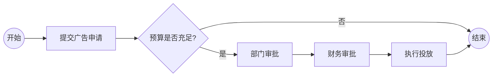

# 一、需求分析（Requirements Analysis）

## 1. 目标（进一步细化）

* **掌握全册 4 大核心模块**

  * 需求分析与需求确定
  * 需求规格说明（UML 建模）
  * 系统设计（体系结构 + 构件 + 接口）
  * 持久性与数据库设计
* **形成“案例驱动”的知识整合能力**

  * 能围绕一个产品（如：电话销售系统、音像商店、校园交易平台）
  * 从业务流程 → 需求 → UML → 架构 → 数据库 **一条线讲清楚**
* **面向考试的能力目标**

  * 看到题目能快速判断：

    * 用 BPMN / 用例图 / 活动图 / 类图 / ER 图
  * 掌握“先分析、再建模、最后总结”的答题套路
* **面向工程的能力目标**

  * 能完成一个**最小闭环**：

    > 需求描述 → 需求建模 → 设计决策 → 落地方案

---

## 2. 知识框架（核心逻辑链路深化）

教材的核心逻辑链路可以总结为一条**需求驱动的软件生命周期主线**：

> **业务过程分析**
> → **需求确定（What）**
> → **可视化建模（How to describe）**
> → **需求规格说明（Formalization）**
> → **从分析到设计（Transition）**
> → **系统设计（How to build）**
> → **GUI 设计（User-facing）**
> → **数据库设计（Data-facing）**
> → **质量与变更管理（Control & Evolution）**

### 核心理解点（常考）

* **需求分析关注“做什么”，不是“怎么做”**
* UML 是**沟通工具**，不是画图本身
* 设计阶段的所有决策，都应能追溯到需求

---

# 二、需求确定与需求规格说明

## 1. 需求确定（Requirements Elicitation & Analysis）

### 1.1 敏捷开发的核心价值观与主要实践

**四大价值观（Scrum / Agile Manifesto）**

1. 个体和交互 **高于** 流程和工具
2. 可工作的软件 **高于** 详尽的文档
3. 客户协作 **高于** 合同谈判
4. 响应变化 **高于** 遵循计划

**主要实践（常考概念）**

* 用户故事（User Story）
* 持续迭代与增量交付
* 持续反馈（Sprint Review）
* Backlog 优先级管理

👉 **考试回答要点**：
敏捷并非不写文档，而是强调**“恰到好处的文档”**。

---

### 1.2 需求管理的主要活动和目标

#### （1）需求标识、分类与文档化

* 功能性需求（Functional）
* 非功能性需求（Non-functional）

  * 性能、安全、可靠性、可维护性、可扩展性
* 业务需求 / 用户需求 / 系统需求

#### （2）需求变更管理

* 需求变更不可避免
* 需建立**变更控制流程**

  * 变更申请 → 影响分析 → 评审 → 决策 → 实施
* 常用工具：变更请求单（CR）

#### （3）需求追踪（Traceability）

* 建立**需求追踪矩阵（RTM）**
* 支持：

  * 需求 → 设计
  * 需求 → 测试用例
* 核心目标：**防止需求遗漏与无源设计**

---

### 1.3 需求确定的核心任务

#### （1）业务过程建模（BPMN）

**BPMN 的作用**

* 描述“业务如何运作”
* 强调跨角色、跨部门的流程

**核心元素**

* 流对象：事件、活动、网关
* 连接对象：顺序流、消息流
* 泳池 / 泳道：参与角色

**考试高频点**

* BPMN 用于**业务层**
* UML 活动图用于**系统层**

**示例**


---

#### （2）需求引导方法（Elicitation Techniques）

* 面谈：深入、定性
* 调查表：定量、大规模
* JAD/RAD：用户深度参与
* 原型法：降低理解偏差

📌 **需求依赖矩阵**

* 显示需求之间的依赖关系
* 用于识别关键需求与风险点

---

#### （3）需求管理（Management）

* 需求唯一标识（ID）
* 优先级排序（MoSCoW）
* 版本控制
* 变更影响分析

---

### 案例理解

* **电话销售系统**

  * 业务词汇表：统一术语
  * 业务用例图：系统边界
  * 业务类图：核心概念
* **广告支出系统**

  * 过程层次图：宏观流程
  * 环境图：系统与外部交互

---

## 2. 需求规格说明（SRS）

### 2.1 架构优先权（Architecture First）

* 架构影响需求表达方式
* 常见架构：

  * MVC
  * J2EE 多层架构（Client / Web / Business / Data）

👉 **考试要点**：
需求规格说明并非“纯需求”，而是**面向实现的需求表达**。

---

### 2.2 三大规格说明模型

#### （1）状态模型（结构模型）

* 类图
* 描述：类、属性、方法、关系
* 强调系统的**静态结构**

#### （2）行为模型

* 用例图   
  
  ```plantuml
    @startuml
    left to right direction
    actor 用户
    actor 管理员

    用户 -- (浏览商品)
    用户 -- (下单)
    用户 -- (支付订单)

    管理员 -- (管理商品)
    管理员 -- (处理订单)
    @enduml
  ```
* 活动图

   ```plantuml
    @startuml
    start
    :选择商品;
    :提交订单;
    if (库存充足?) then (是)
    :生成订单;
    :支付;
    else (否)
    :提示库存不足;
    endif
    stop
    @enduml
   ```
* 顺序图
  
  ```plantuml
    @startuml
    actor User
    participant "OrderController" as OC
    participant "OrderService" as OS
    participant "OrderDAO" as DAO

    User -> OC : submitOrder()
    OC -> OS : createOrder()
    OS -> DAO : save()
    DAO --> OS
    OS --> OC
    OC --> User
    @enduml
  ```
* 强调系统**做什么、如何协作**

#### （3）状态变化模型

* 状态机图
* 
  ```plantuml
    @startuml
    [*] --> 待支付
    待支付 --> 已支付 : 支付成功
    已支付 --> 已发货
    已发货 --> 已完成
    已支付 --> 已取消 : 退款
    @enduml
  ```
* 描述对象生命周期
* 适合状态复杂的业务对象

---

### 2.3 三大模型的作用（必背）

| 模型   | 作用      |
| ---- | ------- |
| 结构模型 | 描述系统的组成 |
| 行为模型 | 描述系统的功能 |
| 状态模型 | 描述对象变化  |

---

# 三、UML 六大视图

1. **用例视图**：系统功能边界
2. **活动视图**：业务或系统流程
3. **结构视图**：类与关系
4. **交互视图**：对象协作顺序
5. **状态机视图**：对象生命周期
6. **实现视图**：构件、部署

### UML 状态机图核心元素

* 状态
* 转换
* 事件
* 守卫条件
* 动作

---

# 四、关键建模原则

### 1. 类图

* 高内聚、低耦合
* 属性私有，行为公开
* ```plantuml
    @startuml
    class User {
    -userId: int
    -name: String
    +login()
    }

    class Item {
    -itemId: int
    -price: float
    }

    class Order {
    -orderId: int
    -status: String
    }

    User "1" --> "many" Order
    Order "1" --> "many" Item
    @enduml
  ```

### 2. 顺序图

* 同步 / 异步消息
* 明确调用关系

### 3. 状态机图

* 只建模“有业务意义”的状态

### 聚合 vs 组合（必考）

* 聚合：弱拥有，生命周期独立
* 组合：强拥有，生命周期绑定

---

# 五、系统设计

## 1. 体系结构设计

### 分层架构

* 表现层
* 业务逻辑层
* 数据访问层

### C/S 与 B/S

* C/S：性能高，维护成本高
* B/S：易维护，跨平台

### 微服务

* 松耦合
* 独立部署
* API 通信

---

## 2. 关键设计环节

### 构件设计

* 职责单一
* 接口隔离

### 接口设计

* 内部接口
* 外部接口（REST）

### 部署设计

* 节点
* 网络拓扑

## 3. 图
* 构建图
* 
  ```plantuml
    @startuml
    component WebUI
    component OrderService
    component UserService
    component Database

    WebUI --> OrderService
    WebUI --> UserService
    OrderService --> Database
    UserService --> Database
    @enduml
  ```
* 部署图
* 
  ```plantuml
    @startuml
    node Client
    node "App Server"
    node "DB Server"

    Client --> "App Server"
    "App Server" --> "DB Server"
    @enduml
  ```

---

# 六、持久性与数据库设计

## 1. 持久性基础

* RDBMS：结构化数据
* NoSQL：高并发 / 非结构化
* 缓存：性能优化

AI 产品：

* 向量存储
* 非结构化数据

---

## 2. 数据库设计流程

### （1）概念模型（ER）

* 实体
* 属性
* 关系

  ```plantuml
    @startuml
    entity User {
    user_id : int <<PK>>
    name : string
    }

    entity Order {
    order_id : int <<PK>>
    user_id : int <<FK>>
    }

    User ||--o{ Order
    @enduml
  ```

### （2）逻辑模型

* 表
* 主键 / 外键

### （3）物理模型

* 索引
* 分区
* 存储策略

---
