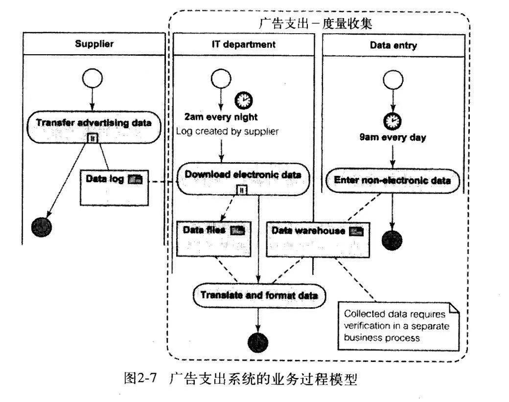

# 需求分析
## 目标
- 掌握全册4大核心模块的关键概念与方法
- 能通过产品案例串联各章节知识
- 熟悉教材高频考点(如BPMN建模、ER图设计、变更流程)，掌握答题思路
- 能独立完成“需求$\to$设计$\to$落地”的简化实战任务

## 知识框架
教材的核心逻辑链路为：业务过程分析$\to$需求确定$\to$可视化建模$\to$需求规格说明$\to$从分析到设计$\to$系统设计$\to$GUI设计$\to$数据库设计$\to$质量与变更管理
这一链路清晰地展示了软件需求从发现到落地的全过程，每个环节都相互关联，共同构成了软件开发的完整生命周期

## 需求确定与规格说明
### *需求确定*
1. **敏捷开发的核心价值管和主要实践**
2. **需求管理的主要活动和目标**
   1. 标识、分类、组织需求，并为需求建立文档
   2. 需求变更
   3. 需求追踪
3. 需求确定的核心任务包括：
   1. 业务确定建模：
      1. 使用BPMN(业务流程建模与符号)进行业务过程建模，包括流对象、连接对象、泳池等元素，例如教材中广告支出系统的BPMN图  
      
   2. 需求引导方法：
      1. 采用面谈、调查表、JAD/RAD(联合应用设计/快速应用开发)、原型法等方法进行需求引导，例如教材中需求依赖矩阵
   3. 需求管理：
      1. 进行需求标识、优先级排序、变更控制等需求管理工作，确保需求的清晰性、一致性和可追溯性
   > 电话销售系统：通过业务词汇表、业务用例图、业务类图等展示了电话销售系统的需求确定过程
   > 广告支出系统：通过过程层次图、环境图等展示了广告支出系统的需求确定过程
### *需求规格说明*
1. 需求规格说明阶段需要考虑体系结构优先权，例如MVC(模型-视图-控制器)和J2EE多层架构(客户端$\to$Web层$\to$业务逻辑层$\to$数据层)等
2. 需求规格说明阶段需要构建三大规格说明模型
   1. 状态模型：通过类图细化类、关联、泛化、接口等元素，例如教材中电话销售系统的类图
   2. 行为模型：通过用例图、活动图、交互图等描述系统的行为，例如教材中电话销售系统的用例图、活动图、顺序图等
   3. 状态变化模型：通过状态图描述对象的状态变化，例如教材中电话销售系统的状态机图
3. **需求规格说明的三大模型及其作用**

## UML 6大视图
1. 用例视图：描述参与者、用例、通信/扩展关系等，例如教材中音像商店的用例图
2. 活动视图：描述动作、控制流、分叉/合并等，例如教材中音像商店的活动图
3. 结构视图：描述类、关联、泛化、聚合等，例如教材中音像商店的类图
4. 交互视图：描述顺序图(生命线、激活)、通信图等，例如教材中音像商店的顺序图
5. 状态机视图：描述状态、转换(事件[守卫]/动作)等，例如教材中音像商店的状态机图
6. 实现视图：描述构件、接口、节点、部署等，例如教材中音像商店的构件图
7. **UML 状态机图的核心元素及其作用**
   
### 例题
1. 校园二手物品交易平台 画出该系统的UML活动图 识别该系统的核心业务类
2. 图书商城需要开发一套订单管理系统 画出该系统的UML用例图 识别该系统的核心业务类
3. 识别该系统的核心类及其关联关系

## 关键建模原则
1. 进行可视化建模时，需要遵循一些关键原则：
   1. 类图：保持高内聚低耦合，合理设置属性可见性(+公有/-私有)
   2. 顺序图：区分消息同步/异步，明确参数方向(in/out)
   3. 状态机图：仅建模“有业务意义”的状态，避免过度细化
2. **面向对象设计中聚合与组合的区别**

## 系统设计
### 体系结构设计
1. 体系结构设计是系统设计的核心，需要考虑不同的架构风格
2. 分层架构：将系统分为表现层、业务逻辑层、数据访问层，例如教材中音像商店的分层架构图
3. **C/S B/S架构**：对比C/S架构和B/S架构的优缺点，例如教材中C/S B/S架构对比表
4. 微服务架构：将系统拆分为独立部署、API通信的微服务，例如教材中微服务架构图

### 关键设计环节
1. 系统设计阶段需要关注以下几个关键环节
   1. 构件设计：将系统拆分为高内聚的构件，并通过接口解耦管理构建之间的依赖关系，例如教材中的构件设计图
   2. 接口设计：设计内部接口和外部接口，例如`Java Interface`、 `REST/SOAP`等，例如教材中接口设计表
   3. 部署设计：确定结点拓扑，例如应用服务器 + 数据库服务器，例如教材中部署设计图
2. 系统体系结构设计的核心原则和主要任务
3. 客户关系管理(CRM)系统
4. PCBMER 框架
5. 能分析员工考勤管理系统的功能性需求和非功能性需求
6. PCBMER 体系结构各层次的核心构件及职责

## 持久性与数据库设计
### 持久性基础
1. 持久性基础包括：
   1. 实现方式：选择合适的持久性实现方式，例如RDBMS(MySQL)、NoSQL(MongoDB)、文件系统 + 缓存(Redis)等，例如教材中持久性实现方式表
   2. AI产品特殊需求：考虑AI产品的特殊需求，例如非结构化数据存储、高并发读写等

### 数据库设计流程
1. 数据库设计流程包括：
   1. 概念模型(ER图)：使用ER图描述实体、属性、关系(1:1/1:n/m:n)，例如教材中音像商店的ER图
   2. 逻辑模型：将ER图转化为关系模式，例如教材中音像商店的逻辑模型表
   3. 物理模型：设计表结构(主键、外键、索引)、分区策略(时间/哈希)等，例如教材中音像商店的物理模型图
