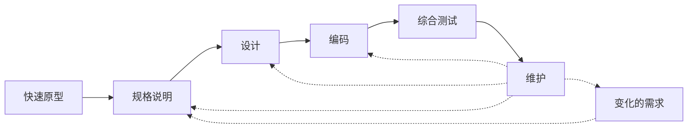
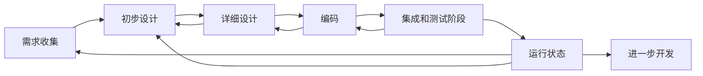
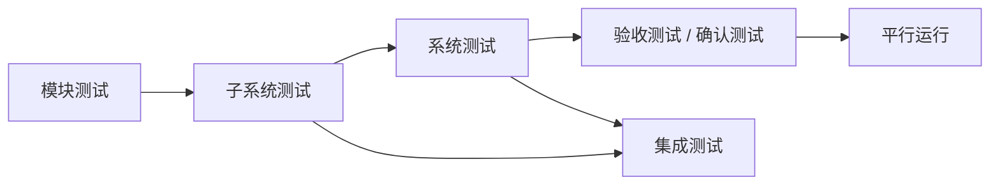

# 软件工程导论
## 序章
### 软件危机
- **定义** 指在计算机软件的开发和维护过程中所遇到的一系列严重问题
- **典型表现**
1. 对软件开发成本和进度的估计常常不准确
2. 用户对“已完成的”软件系统不满意的现象经常发生
3. 软件产品的质量往往靠不住
4. 软件常常是不可维护的
5. 软件通常没有适当的文档资料
6. 软件成本在计算机系统总成本中所占的比例逐年上升
7. 软件开发生产率提高的速度，远远跟不上计算机应用迅速普及深入的趋势

### 软件工程
- **本质特征**
1. 软件工程关注于大型程序的构造
2. 软件工程的中心课题是控制复杂性
3. 软件经常变化
4. 开发软件的效率非常重要
5. 和谐地合作是开发软件的关键
6. 软件必须有效地支持它的用户
7. 在软件工程领域中通常由一种文化背景的人替具有另一种文化背景的人创造产品

- **基本原理**
1. 用分阶段的生命周期计划严格管理
2. 坚持进行阶段评审
3. 实行严格的产品控制
4. 采用现代程序设计技术
5. 结果应能清楚地审查
6. 开发小组的人员应该少而精
7. 承认不断改进软件工程时间的必要性

### 软件生命周期的阶段
- **八个阶段** 问题定义、可行性研究、需求分析、总体设计、详细设计、编码与单元测试、综合测试、维护
- **三个时期**定义时期、开发时期、维护时期

### 快速原型模型
- 是快速建立起来的可以在计算机上运行的程序，它所能完成的功能往往是最终产品能完成的功能的一个子集


## 软件过程
- **定义** 是为了获得高质量软件所需要完成的一系列任务的框架，它规定了完成各项任务的工作步骤
### 瀑布模型


### 喷泉模型


## 可行性研究
- 目的 用最小的代价在尽可能短的时间内确定问题是否能够解决  
***可行性研究的目的不是解决问题，而是确定问题是否值得去解决***  
### 研究方面
1. 技术可行性
2. 经济可行性
3. 操作可行性
   
### 数据流图（DFD）
1. 矩形 / 长方体： 数据的源点 / 终点
2. 圆角矩形 / 圆形： 变换数据的处理
3. 半矩形 / 双直线： 数据存储
4. 箭头： 数据流
5. 数据A和B同时输入才能变换成数据C
   ```mermaid
   graph LR
        A --> T(*T)
        B --> T(*T)
        T --> C
   ```
6. 数据A变换成B和C
   ```mermaid
    graph LR
        A --> T(T*)
        T --> B
        T --> C
   ```
7. 数据A或B，或A和B同时输入变成C
    ```mermaid
    graph LR
        A --> T(+T)
        B --> T
        T --> C
    ```
8. 数据A变换成B或C，或B和C
   ```mermaid
    graph LR
        A --> T(T+)
        T --> B
        T --> C
   ```
9. 只有数据A或只有数据B输入时变换成C
    ```mermaid
    graph LR
        A --> T(⊕T)
        B --> T
        T --> C
    ```
10. 数据A变换成B或C，但不能变换成B和C
    ```mermaid
    graph LR
        A --> T(⊕T)
        T --> B
        T --> C
    ```
- 与门电路相同

## 需求分析
- **定义** 是软件定义时期的最后一个阶段，它的基本任务是准确地回答**系统必须做什么**这个问题

### 对系统的综合要求
1. 功能需求
2. 性能需求
3. 可靠性和可用性需求
4. 出错处理需求
5. 接口需求
6. 约束
7. 逆向需求
8. 将来可能提出的要求

### 面向数据流自顶向下求精
- **定义** 自顶向下求精是一种分解方法，先从系统的高层次需求和功能出发，逐步细化每个部分的功能，直到达到合适的粒度，使系统的每个部分都清晰、可实现
- **实现方式** 通过分解大功能为多个小功能，逐步展开系统的模块。在每一层细化过程中，确保数据流在不同模块之间的传递是清晰和一致的

### ER图（实体-联系图）
- **ER图的基本组成要素**
ER图的核心要素包括实体、属性、关系等。以下是这些要素的详细讲解：

1. **实体（Entity）**  
   - 定义：实体是指具有独立存在的事物，可以是物理的或抽象的  
   - 表示：在ER图中，实体通常用矩形表示

2. **属性（Attribute）**  
   - 定义：属性是实体的特征或特性  
   - 表示：属性通常用椭圆形或圆角矩形表示，并通过一条线连接到实体。
      1. 简单属性（Simple Attribute）：不可再分的基本属性
      2. 复合属性（Composite Attribute）：由多个简单属性组成的属性
      3. 多值属性（Multivalued Attribute）：一个实体可以有多个值的属性
      4. 派生属性（Derived Attribute）：通过其他属性计算得到的属性
3. **实体集（Entity Set）**  
   - 定义：实体集是指同一类型的实体的集合，例如所有学生构成学生实体集  
   - 表示：实体集用矩形框表示，属性用椭圆连接到实体集
4. **关系（Relationship）**  
   - 定义：关系是描述两个或多个实体之间的联系  
   - 表示：关系用菱形表示，并通过线连接相关的实体
      1. 1对1（1:1）：一个实体只与另一个实体相关联。
      2. 1对多（1:N）：一个实体与多个实体相关联。
      3. 多对多（M:N）：多个实体与多个实体相关联。
5. **关联度（Cardinality）**  
   - 定义：关联度表示实体之间关系的数量限制。  
   - 常见的关联度有：  
     1. 1对1：每个实体只能与另一个实体相关联
     2. 1对多：一个实体可以与多个实体关联，而另一个实体只能与一个实体关联
     3. 多对多：多个实体可以与多个实体关联  
   - 关联度的表示：关系菱形上方或旁边标明数字表示关联度
6. **强实体与弱实体**  
   - 强实体：具有独立存在的实体，通常不依赖于其他实体
   - 弱实体：没有独立存在能力的实体，它依赖于另一个实体  
   表示：弱实体用双矩形框表示，弱实体与强实体之间的关系用双菱形表示  

- **总结** 实体（矩形）可以具有多种属性（圆角矩形），两个实体之间由关系（菱形）连接

### 状态图
1. **状态（State）**
   - 定义：状态是系统或对象在某一时刻所处的特定情形。状态描述了对象的特征、行为或属性的一个稳定阶段
   - 表示：通常用**圆角矩形**表示
2. **事件（Event）**
   - 定义：事件是触发状态转移的条件或外部输入，通常是外部系统或用户的行为、或者是系统内部的某种情况变化
   - 表示：通常用箭头指向相应的状态转移
3. **状态转移（Transition）**
   - 定义：表示对象或系统从一个状态进入另一个状态的过程，通常是由某个事件引起的
   - 表示：用带箭头的线表示
4. **初始状态（Initial State）**
   - 定义：表示系统或对象开始时所处的状态
   - 表示：一个填充的圆点
5. **终止状态（Final State）**
   - 定义：是对象生命周期的结束状态，一旦达到该状态，系统或对象的生命周期就结束
   - 表示：一个带有圆圈的圆点

### 验证软件需求的方法
1. 验证需求的一致性
2. 验证需求的现实性
3. 验证需求的完整性和有效性

## 形式化说明技术
### 有穷状态机
- **范式**：当前状态 + 事件 + 谓词 -> 下个状态  
或许可以认为是一个公理系统

## 总体设计
### 模块化
- 高内聚低耦合
- 目的：把复杂的问题分解成许多容易解决的小问题
### 耦合
- 定义：对一个软件结构内不同模块之间互连程度的度量
- 分类：
1. 低耦合
   - 数据耦合：两个模块彼此间通过参数交换信息，而且减缓的信息仅仅是数据
2. 中耦合
   - 控制耦合
   - 特征耦合：把整个数据结构作为参数传递而被调用的模块指需要使用期中一部分数据元素
- 公共环境耦合：两个或多个模块通过一个公共数据环境相互作用
1. 高耦合
   - 内容耦合：一个模块访问另一个模块的内部数据 或
   一个模块不通过正常入口而转到另一个模块的内部 或
   两个模块有一部分程序代码重叠（只在汇编中出现）或 
   一个模块有多个入口

### 内聚
- 定义：标志着一个模块内各个元素彼此结合的紧密程度
- 分类：
1. 低内聚：
   - 偶然内聚
   - 逻辑内聚
   - 时间内聚
2. 中内聚
   - 过程内聚
   - 通信内聚
3. 高内聚
   - 顺序内聚
   - 功能内聚

### 层次图
- 一个矩形代表一个模块
- 方框间的连线表示**调用**关系
- **层次方框图中的连线代表组成**

## 详细设计
### 判定表
四通道 -> 单通道，用数理逻辑连接，上方为逻辑（TF），下方用`X`表示进行该项动作
### 判定树
写c语言

## 实现
### 测试步骤


### 单元测试
- 集中检测软件设计的最小单元 -- 模块

### 集成策略
1. 自底向上
2. 自顶向下

### 面向对象
- 核心模型：
   1. 功能模型
   2. 对象模型
   3. 动态模型
- 特性：
  1. 封装
  2. 继承
  3. 多态

### 回归测试
- 指重新执行已经做过的测试的某个子集，以保证上述这些变化没有带来非预期的副作用

### 测试的两大流派
- 白盒测试、黑盒测试

### 可靠性与可用性
#### 可靠性
- 定义：程序在给定的时间间隔内，按照规格说明书的规定成功地运行的概率
#### 可用性
- 定义：程序在给定的时间点，按照规格说明书的规定，成功运行的概率
#### 差别
- 可靠性意味着在0到t这段时间间隔内系统没有失效
- 可用性只意味着在时刻t，系统是正常运行的

### 调试
- 定义：把症状和原因联系起来的尚未被人深入认识的智力过程

### 软件
- 定义：源码，配置，文档

## 维护
### 分类
1. 改正性维护
2. 适应性维护
3. 完善性维护
4. 预防性维护